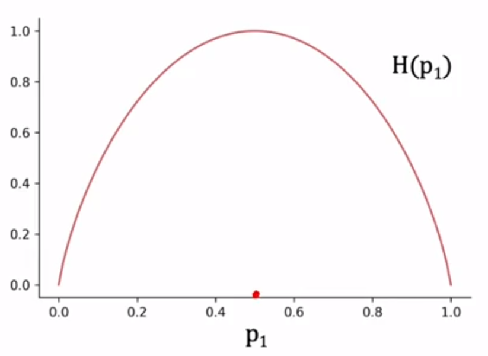
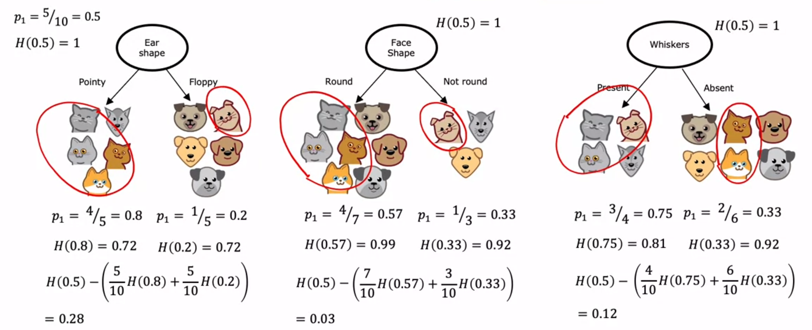

# Decision Trees Learning
A decision tree is a machine learning model that makes decisions based on a sequence of questions asked about the features of the data. These models are particularly useful for classification tasks, such as identifying whether an animal is a cat or a dog based on specific features.

## Building a Decision Tree
Building a decision tree involves several key steps:

- **Choosing the feature to split on:** The first step in building a decision tree is deciding which feature to use at the root node, i.e., the first node at the top of the tree. This is done using a specific algorithm that maximizes the purity of the nodes.

- **Creating branches based on feature values:** Once a feature is chosen, the training examples are divided based on the value of that feature. For example, if we choose 'ear shape' as the feature, the training examples will be divided into two groups: one group with pointy ears and the other group with floppy ears.

- **Continuing the process on each branch:** This process is then repeated for each branch of the tree. A new feature is chosen, and the training examples in that branch are further divided based on the value of the new feature.

- **Creating leaf nodes for predictions:** Once a subset of the examples in a branch belongs to a single class (e.g., all cats or all dogs), a leaf node is created that makes a prediction for that class.

## Key Decisions in Building a Decision Tree
There are two main decisions to make when building a decision tree:

- **How to choose the feature to split on:** The goal when choosing a feature is to maximize the `purity` of the nodes, i.e., make the subsets of examples as close as possible to belonging to a single class (either all cats or all dogs in our example).

- **When to stop splitting:** The criteria for stopping the splitting process could be when all examples in a node belong to the same class or when the depth of the tree reaches a certain limit. This is done to prevent the tree from becoming too large and to avoid overfitting.

## Entropy as a Measure of Purity
Entropy is a measure of the purity of a node or, in other words, how mixed the labels in a node are. A node with only dogs or only cats has no entropy (or no uncertainty) and is thus pure, while a node with an equal number of dogs and cats has an entropy of 1 (or maximum uncertainty).

### Entropy: The Basics
Given a set of six examples, three cats and three dogs, we define $p_1$ as the fraction of examples that are cats. In this case, $p_1 = \frac{3}{6}$.

Impurity of a dataset is measured using the entropy function, conventionally denoted as $H(p_1)$. The function resembles a curve where the horizontal axis is $p_1$ (the fraction of cats) and the vertical axis is the value of the entropy. The highest point of the curve indicates the maximum impurity (an entropy of 1) when the set of examples is a 50-50 mix. When all examples are cats or not cats, the entropy is zero.

### Further Understanding Entropy
- A set with five cats and one dog $p_1 = 5/6 \text{ or } ~0.83$, has an entropy of ~0.65.
- A sample of six images all being cats $(p_1 = 6/6)$ has an entropy of zero.
- A sample with two cats and four dogs $(p_1 = 2/6 \text{ or } 1/3)$, has an entropy of ~0.92, indicating more impurity due to its closer proximity to a 50-50 mix.
- A set of all dogs $(p_1 = 0)$ has an entropy of 0, indicating no impurity or a completely pure set.

### The Entropy Function
The entropy function $H(p_1)$ is defined as:

$$H(p_1) = -p_1log_2(p_1) - (1 - p_1)log_2(1 - p_1)$$

where $p_0$ is equal to the fraction of examples that are not cats $(1 - p_1)$. Logarithms are taken to the base two for the sake of convention. It's important to note that the function will consider $0log(0)$ as 0 for the purpose of computing entropy. The entropy function or the Gini criteria can be effectively used to build decision trees.

## Information Gain
Information gain is the measure of the difference in entropy from before to after the set is split on an attribute. Constructing a decision tree is all about finding attribute that returns the highest information gain (i.e., the most homogeneous branches).

### Entropy and Information Gain
Entropy is a measure of the impurity or disorder of the samples at a node. A high entropy means that the samples are mixed, not purely one label or another, while low entropy implies the samples are mostly of the same label.

Information gain is the reduction in entropy achieved by partitioning the samples based on a feature. The larger the information gain, the more the feature reduces entropy and therefore the more useful it is for making decisions in our tree.

### How to compute Information Gain
- Start with the entropy at the root node, which is the entropy with all the samples and their labels.
- Consider each feature and calculate the entropy for each of the resulting branches if the node was split using that feature.
- Compute a weighted average of these entropy values based on the number of samples in each branch.
- The information gain for a feature is the difference between the root node's entropy and this weighted average entropy.
- Repeat the process for all the features, and the feature with the highest information gain is the best choice for the node split.

### Information Gain: The Details
Information gain is calculated by comparing the entropy of the dataset before and after a split. We define a function that calculates the entropy of a given set as:

