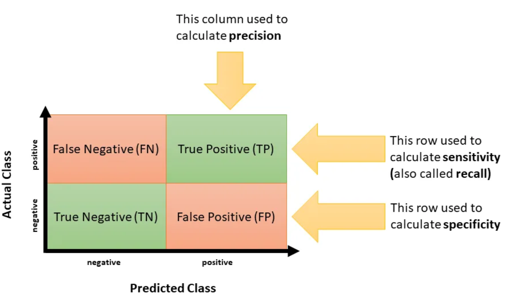
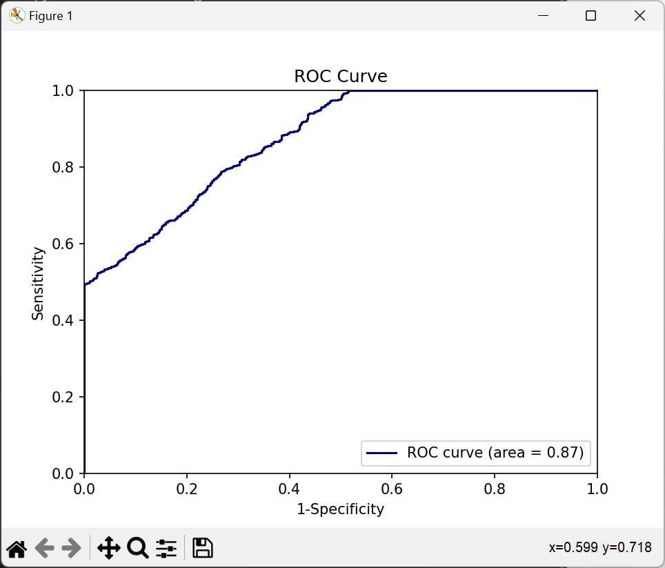

# 🌟 Receiver Operating Characteristics (ROC) 🌟
The Receiver Operating Characteristics, or ROC, is a crucial tool used to evaluate the performance of binary classification models. In simpler terms, it helps us understand how well our model is doing in distinguishing between two classes (like 'sick' vs 'not sick').

## 🎯 ROC Curve 🎯
The ROC curve is a plot of the true positive rate (TPR) against the false positive rate (FPR) for the different possible cutpoints of a diagnostic test. The area under the ROC curve (AUC) is a measure of how well a parameter can distinguish between two diagnostic groups (diseased/normal). The closer the AUC is to 1, the better the parameter is at distinguishing between the two groups. The closer the AUC is to 0.5, the less accurate the parameter is at distinguishing between the two groups.

## 🎯 Key Metrics 🎯

### 1️⃣ Sensitivity (True Positive Rate)
Sensitivity measures how well the model identifies true positives from the actual positive cases. Imagine you are testing for a rare disease. Sensitivity tells you how many of the sick people the test correctly identifies.

$$Sensitivity = \frac{TP}{TP+FN}$$
 
### 2️⃣ Specificity (True Negative Rate)
On the flip side, specificity measures how well the model identifies true negatives from the actual negative cases. Using the same example, specificity will tell you how many of the healthy people the test correctly identifies as not having the disease.

$$Specificity = \frac{TN}{TN+FP}$$

### 3️⃣ Precision (Positive Predictive Value)
Precision provides insight into how many of the cases that the model predicted as positive were actually positive.

$$Precision = \frac{TP}{TP+FP}$$

### 4️⃣ Accuracy
Accuracy gives an overall view of how well the model is performing by considering both true positives and true negatives.

$$Accuracy = ​\frac{TP+TN}{TP+TN+FP+FN}$$

#### 🔍 Note:
- TP: True Positives - Actual positive cases that were correctly identified.
- TN: True Negatives - Actual negative cases that were correctly identified.
- FP: False Positives - Actual negative cases that were wrongly identified as positive.
- FN: False Negatives - Actual positive cases that were wrongly identified as negative.