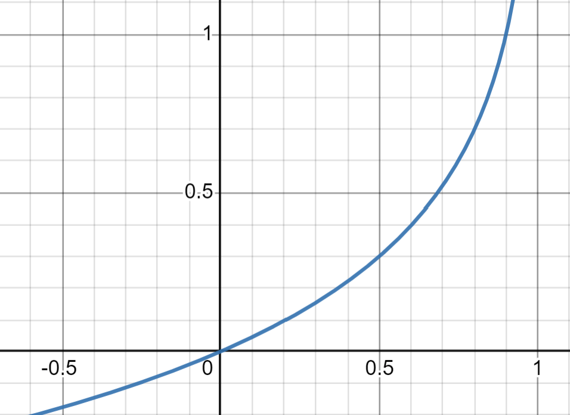

# Logistic Regression
Logistic regression is a statistical technique capable of predicting a binary outcome. It's a classification algorithm that is used for the prediction of the probability of a categorical dependent variable. The dependent variable is a binary variable that contains data coded as 1 (yes, success, etc.) or 0 (no, failure, etc.).

## Background
Out of 10 students, 8 of them passed the exam and 2 of them failed. The probability of passing the exam is 0.8 and the probability of failing the exam is 0.2. Alternatively, the `odds` of passing the exam is 4 (0.8/0.2). The formula for odds is:

$$odds = \frac{p}{1-p}$$

where $p$ is the probability of success. The formula for probability is:

$$p = \frac{odds}{1+odds}$$

**Odds Ratio (OR)** is the ratio of the odds of success in one group to the odds of success in another group. The formula for odds ratio is:

$$odds\_ratio = \frac{odds_{group_1}}{odds_{group_2}}$$

Note that:
- $0 < p < 1$
- $0 < odds < \infty$
- $0 < odds\_ratio < \infty$
- $-\infty < ln(odds) < \infty$
- If $O = 1$, then $p = q = 0.5$
- $O_{success} = \frac{1}{O_{failure}}$

## Simple Logistic Regression
The simple logistic regression model is used to model probability that the response variable Y belongs to a particular category of two possible categories. 

Given a set of predictors $X_1, X_2, ..., X_n$, the model estimates the probability that $Y = 1$ given the values of $X_1, X_2, ..., X_n$. An inital thought might be to use linear regression to model the probability of $Y = 1$:

$$P(Y=1|X) = \beta_0 + \beta_1X + \beta_2X + ... + \beta_nX + \epsilon$$

However, this model is not appropriate because the left-hand side of the equation is a probability, and probabilities must always be between 0 and 1; while the right-hand side of the equation can take on any real value. Therefore, we must model $P(Y=1|X)$ using a function that gives outputs between 0 and 1 for all values of $X$.

We transform the left-hand side of the equation using the `logit function`:

$$P(Y=1|X) \in [0,1] \rightarrow Odds \in [0,\infty] \rightarrow ln(Odds) \in [-\infty,\infty]$$

Where the logit function is defined as:

$$ln(odds) = ln(\frac{p}{1-p}) = logit(p)$$

Therefore, following these transformations, the model becomes:

$$ln(\frac{p}{1-p}) = \beta_0 + \beta_1X + \beta_2X + ... + \beta_nX + \epsilon$$

$$p = \frac{e^{z}}{1+e^{(\beta_0 + \beta_1X + \beta_2X + ... + \beta_nX)}}

Let $Z = \beta_0 + \beta_1X + \beta_2X + ... + \beta_nX$, then:

$$p = \frac{e^{z}}{1+e^{z}}$$

Multiplying the numerator and denominator by $e^{-z}$, we get:

$$p = \frac{1}{1+e^{-z}}$$

This is the `sigmoid function` or `logistic function`:

$$\sigma(z) = \frac{1}{1+e^{-z}}$$

## Cost Function
In contrast to linear regression, which uses mean squared error as the cost function, logistic regression uses a `logarithmic loss function` or `cross entropy loss function`. This is because the output of logistic regression is a probability between 0 and 1, while the output of linear regression is a continuous value. 

The loss function for a single training example is defined as:

$$L(f_{w,b}(x^{(i)}), y^{(i)}) = \begin{cases} 
-log(f_{w,b}(x^{(i)})) & \text{if } y^{(i)} = 1 \\ 
-log(1-f_{w,b}(x^{(i)})) & \text{if } y^{(i)} = 0 
\end{cases}$$

A more compact way to write the loss function is:

$$J(w,b) = -\frac{1}{m}\sum_{i=1}^{m}y^{(i)}log(f_{w,b}(x^{(i)})) + (1-y^{(i)})log(1-f_{w,b}(x^{(i)}))$$

This is because when $y^{(i)}=1$, the second term $(1-y^{(i)})log(1-f_{w,b}(x^{(i)}))$ becomes 0. Similarly, when $y^{(i)}=0$, the first term $y^{(i)}log(f_{w,b}(x^{(i)}))$ becomes 0.

The cost function for the entire training set is the average of the loss function for each training example:

$$J(w,b) = -\frac{1}{m}\sum_{i=1}^{m}y^{(i)}log(f_{w,b}(x^{(i)})) + (1-y^{(i)})log(1-f_{w,b}(x^{(i)}))$$

## Cost Function Intuition
The negative log function is a convex function shown below. This means that gradient descent will always converge to the global minimum.

- **Case 1:** $y=1$
The graph of $-log(f_{w,b}(x^{(i)}))$ is shown below:

In this case, if $f_{w,b}(x) = 1$, the loss is 0. If $f_{w,b}(x) \rightarrow 0$, the loss goes to infinity. Therefore, the model will try to predict a probability close to 1 for $y=1$ and penalize the model heavily if it predicts a probability close to 0.

- **Case 2:** $y=0$
The graph of $-log(1-f_{w,b}(x^{(i)}))$ is shown below:

In this case, if $f_{w,b}(x) = 0$, the loss is 0. If $f_{w,b}(x) \rightarrow 1$, the loss goes to infinity. Therefore, the model will try to predict a probability close to 0 for $y=0$ and penalize the model heavily if it predicts a probability close to 1.

## Gradient Descent
Gradient Descent is an iterative optimization algorithm used to minimize a function, in this case, the cost function. The algorithm repeatedly takes steps proportional to the negative of the gradient of the function at the current point to reach a local or global minimum.

The update rules in the context of logistic regression are:

$$w := w - \alpha \frac{\partial J(w,b)}{\partial w}$$

$$b := b - \alpha \frac{\partial J(w,b)}{\partial b}$$

where:
- $w, b$ are the parameters of the model that we will optimize
- $\alpha$ is the learning rate
- $J(w,b)$ is the cost function

## Logistic Regression with Regularization
Regularization is a technique used to prevent overfitting by discouraging overly complex models in some way. In the case of logistic regression, L2 regularization is often used, which involves adding an extra term to the cost function.

The cost function for logistic regression with L2 regularization is:

$$J(w,b) = -\frac{1}{m}\sum_{i=1}^{m}y^{(i)}log(f_{w,b}(x^{(i)})) + (1-y^{(i)})log(1-f_{w,b}(x^{(i)})) + \frac{\lambda}{2m}\sum_{j=1}^{n}w_j^2$$

where:
- $\lambda$ is the regularization parameter
- $n$ is the number of features
