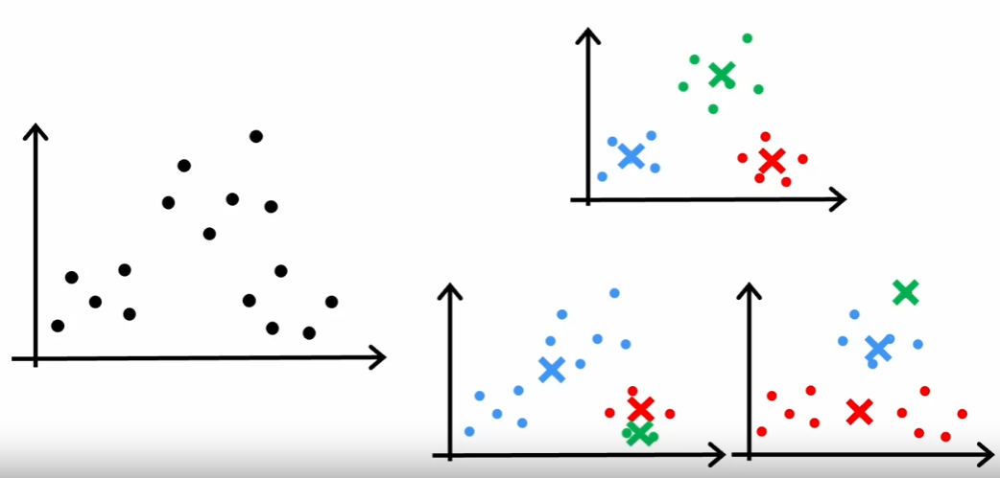

# K-means Clustering: A Quick Walkthrough

## Introduction
K-means clustering is an iterative, unsupervised machine learning algorithm that separates a given dataset into K clusters. It does this by minimizing the **in-cluster variance**, which is computed as the sum of the Euclidean distances between each data point and the centroid of its assigned cluster.

## The Process
Assume we have a dataset of 30 unlabeled training examples. These examples are plotted as points on a 2D grid. We want to apply K-means clustering to this dataset.

Here's how it works:

### Step 1: Initialize Cluster Centroids
To begin, K-means randomly selects $K$ data points as the initial centroids. In this example, we want to find two clusters, so $K=2$.

### Step 2: Assign Points to Cluster Centroids
Now, for each data point in the dataset, the algorithm assigns it to the nearest centroid. This is done by calculating the Euclidean distance between the data point and each centroid. The data point is assigned to the centroid to which it has the shortest distance.

### Step 3: Recalculate Cluster Centroids
Next, K-means recalculates the centroids by taking the mean of all data points assigned to each centroid's cluster. This essentially shifts the centroids to the average location of their respective clusters.

### Step 4: Repeat Steps 2 and 3
The algorithm repeats the assignment and update steps until the positions of the centroids stabilize, and the clusters become consistent. This means that the assignment of data points to clusters no longer changes.

Throughout this iterative process, some data points may change their cluster membership as the centroids shift. The algorithm continues to run until it reaches a point where no changes are observed in the assignment of points to clusters or the positions of centroids.

## K-means Algorithm
Here's a pseudocode implementation of the K-means algorithm:

```
Randomly initialize K cluster centroids (μ1, μ2, ..., μK) ∈ ℝn

Repeat {
    # assign points to clusters
    for i = 1 to m {
        c(i) := index (from 1 to K) of cluster centroid closest to x(i)
        # min ||x(i) - μk||^2
    }

    # move centroids to average of assigned points
    for k = 1 to K {
        μk := average (mean) of points assigned to cluster k
    }
}
```

Corner cases:
- If a cluster ends up with no points assigned to it, then the centroid is not updated. This is because the average of zero points is undefined. In this case, it's best to randomly reinitialize the centroid or remove the cluster altogether and run the algorithm again with $K-1$ clusters.

## K-means Optimization Objective
The K-means optimization objective is the **in-cluster variance**. It is computed as the sum of the squared Euclidean distances between each data point and the centroid of its assigned cluster. This cost function is the same as the one used in linear regression, except that the hypothesis function $h_\theta(x)$ is replaced by the centroid $\mu_c$.

$$ J(c^{(1)}, ..., c^{(m)}, \mu_1, ..., \mu_K) = \frac{1}{m} \sum_{i=1}^m ||x^{(i)} - \mu_{c^{(i)}}||^2 $$

where $c^{(i)}$ is the index of the cluster (1, 2, ..., K) to which example $x^{(i)}$ is assigned, and $\mu_{c^{(i)}}$ is the centroid itself. This cost function is also known as the **distortion** of the dataset. The goal of K-means is to minimize the distortion of the dataset. This is done by finding the optimal values of $c^{(1)}, ..., c^{(m)}$ and $\mu_1, ..., \mu_K$.

## K-means Initialization
K-means is prone to local optima, so it's important to run the algorithm multiple times with different initializations. The algorithm is run for a fixed number of iterations, and the initialization that produces the lowest distortion is chosen.



- **Random initialization**: Randomly select $K$ data points from the dataset and set them as the initial centroids. This method is simple and fast, but it can produce suboptimal results if the initial centroids are chosen poorly.

```
# this range can be between 50 and 1000
For i = 1 to 100 {
    Randomly initialize K cluster centroids (μ1, μ2, ..., μK) ∈ ℝn
    Run K-means to get (c1, ..., cm, μ1, ..., μK)
    Compute cost function (distortion) J(c1, ..., cm, μ1, ..., μK)
}

Pick clustering that gave lowest cost J
```

## Choosing the Number of Clusters $(K)$
The number of clusters $K$ is a hyperparameter of the K-means algorithm. It is chosen by the data scientist, and it is not learned by the algorithm. There are two main methods for choosing $K$:

### Elbow Method
The elbow method is a heuristic for choosing $K$ based on the distortion of the dataset. The distortion is computed for different values of $K$, and the value of $K$ at which the distortion starts to decrease more slowly is chosen. The name "elbow method" comes from the shape of the plot of distortion vs. $K$, which resembles an elbow.