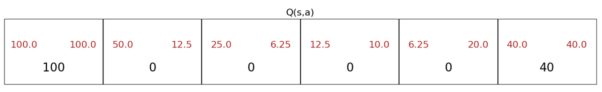

# Reinforcement Learning
Reinforcement learning is a type of machine learning that enables an agent to learn in an interactive environment by trial and error using feedback from its own actions and experiences. Reinforcement learning is different from supervised learning in a way that in supervised learning the training data has the answer key with it so the model is trained with the correct answer itself whereas in reinforcement learning, there is no answer but the reinforcement agent decides what to do to perform the given task. In the absence of training dataset, it is bound to learn from its experience.

## Applications
- Controlling robots
- Playing games
- Factory automation
- Self-driving cars
- Financial (stock) trading

## Reinforcement Learning Terminologies
* **Agent**: The learner or decision-maker is called the agent. The agent takes actions (that is, interacts with the environment) and in return, it receives rewards/penalties.
* **Environment**: The world in which the agent is placed is called the environment. The environment is the interface between the agent and the outside world. The agent sends an action to the environment and the environment responds back with an observation and a reward (or penalty).
* **Action**: The set of actions that the agent can perform is called the action space. The action space can be continuous or discrete. For example, the action space for a car can be the steering angle and the acceleration. The action space for a robot can be the joint torques of the robot. The action space for a game can be the set of all possible moves that the player can make.
* **State**: The state of the environment is the set of all the information that describes the environment at a given time. The state can be observable or partially observable. For example, the state of a chess game is the position of all the pieces on the board. The state of a robot can be the joint angles and the joint velocities. The state of a car can be the position and the velocity of the car. The state of a game can be the position of all the players and the ball.
* **Reward**: The reward is the feedback from the environment. The reward can be positive or negative. The goal of the agent is to maximize the total reward. For example, the reward for a chess game can be +1 if the agent wins, 0 if the game is drawn, and -1 if the agent loses. The reward for a car racing game can be +1 if the car crosses the finish line within the given time, 0 if the car fails to cross the finish line within the given time, and -1000, for example, if the car crashes because we want to discourage the car from crashing and thus a large negative reward is given.
* **Policy**: The policy is the strategy that the agent employs to determine the next action based on the current state. The policy can be deterministic or stochastic. For example, the policy for a chess game can be a lookup table that maps the current state to the next action. The policy for a car racing game can be a neural network that takes the current state as input and outputs the steering angle and the acceleration. The policy for a robot can be a set of if-else statements that map the current state to the joint torques.
* **Discount Factor**: The discount factor is a number between 0 and 1 that determines the importance of future rewards. A discount factor of 0 makes the agent short-sighted by only considering current rewards. A discount factor of 1 makes the agent far-sighted by considering future rewards with equal weight as current rewards. For example, if the discount factor is 0.9, then the agent will consider future rewards to be 90% as important as current rewards.
* **Value Function**: The value function is the expected total reward that the agent will receive starting from the current state. The value function is the sum of all the discounted future rewards. The value function can be used to determine the next action. For example, if the value function is high for a given state, then the agent will take an action that leads to that state. The value function can be estimated using a neural network. The value function is also called the Q-function.

In reinforcement learning, the agent is in a state $s_t$ at time $t$. The agent takes an action $a_t$ based on the policy $\pi(s_t) = a_t$. The environment transitions to a new state $s_{t+1}$ and gives a reward $r_{t+1}$. The goal of the agent is to maximize the total reward. The total reward is the sum of all the rewards from time $t=0$ to $t=T$.

## Markov Decision Process
A Markov decision process (MDP) is a discrete-time stochastic control process. It provides a mathematical framework for modeling decision making in situations where outcomes are partly random and partly under the control of a decision maker. MDPs are useful for studying optimization problems solved via dynamic programming and reinforcement learning.

## State-Action Value Function
The state-action value function $Q(s, a)$ is the expected total reward (or return) that the agent will receive starting from state $s$ and taking action $a$. The state-action value function is also called the Q-function.

$Q(s, a) =$ Return if you start in state $s$, take action $a$ (once), and then behave optimally after that (i.e., follow the optimal policy). The optimal policy is the policy that maximizes the total reward (or return) given the current state: $\max_{a} Q(s, a)$.

$Q(s, a)$ is the expected total reward that the agent will receive starting from state $s$ and taking action $a$ and is also given by:

$$Q(s, a) = R_1 + \gamma R_2 + \gamma^2 R_3 + \gamma^3 R_4 + \cdots$$

$$Q(s, a) = R_1 + \gamma (R_2 + \gamma R_3 + \gamma^2 R_4 + \cdots)$$

$$Q(s, a) = R_1 + \gamma Q(s', a')$$

where $R_1$ is the reward for the current state $s$ (also called the immediate reward), $R_2$ is the reward for the next state $s'$, and so on.

## Bellman Equation
The Bellman equation is a necessary and sufficient condition for optimality associated with the mathematical optimization method known as dynamic programming. It writes the relationship for the value of a decision problem at one point in time, in terms of the payoff from some initial choices and the value of the remaining decision problem that results from those initial choices.

The Bellman equation for the state-action value function $Q(s, a)$ is given by:

$$Q(s, a) = R(s) + \gamma \max_{a'} Q(s', a')$$

where $R(s)$ is the reward for the current state $s$, $\gamma$ is the discount factor, $s'$ is the next state, and $a'$ is the next action. Consider the following illustration with $\gamma = 0.5$:

If the agent is in state 2 and takes action $\rightarrow$, then the agent will receive a reward of 0 and will transition to state 3. The return for this action is given by:

$$Q(2, \rightarrow) = R(2) + 0.5 \max_{a'} Q(3, a') = 0 + 0.5 \max(25, 6.25) = 12.5$$

Similarly, if the agent is in state 4 and takes action $\leftarrow$, then the agent will receive a reward of 0 and will transition to state 3. The return for this action is given by:

$$Q(4, \leftarrow) = R(4) + 0.5 \max_{a'} Q(3, a') = 0 + 0.5 \max(25, 6.25) = 12.5$$

## Stochastic Environment
In a stochastic environment, the next state $s'$ and the reward $R(s)$ are random variables. For example, if the agent is in state 2 and takes action $\rightarrow$, then the agent will transition to state 3 with probability 0.8 and will transition to state 1 with probability 0.2 (due to factors like wind, friction, etc.). In this case, the return is a random variable and therefore, the state-action value function $Q(s, a)$ is also a random variable. Therefore, instead of maximizing the state-action value function $Q(s, a)$, we maximize the expected (or average) state-action value function $\mathbb{E}[Q(s, a)]$ given by:

$$Q(s, a) = R(s) + \gamma \max_{a'} \mathbb{E}[Q(s', a')]$$

where $\mathbb{E}[R(s)]$ is the expected reward for the current state $s$, $\gamma$ is the discount factor, $s'$ is the next state, and $a'$ is the next action.

## Continuous State Space
In a continuous state space, the state $s$ is a continuous variable. For example, the state $s$ can be the position and velocity of a car. In this case, the state-action value function $Q(s, a)$ is also a continuous variable.

## Learning Algorithm
The learning algorithm is used to learn the state-action value function $Q(s, a)$. The learning algorithm is given by:

- Initialize neural network randomly as guess of $Q(s, a)$
- Repeat:
    - Take actions to get experience: $(s, a, R(s), s')$
    - Store experience in replay memory or `experience replay buffer.` The replay memory is a list of tuples $(s, a, R(s), s')$ (for instance, 10,000 most recent tuples) that is used to train the neural network.
    - Train model:
        - Create training data by sampling from replay memory using $x = (s, a)$ and $y = R(s) + \gamma \max_{a'} Q(s', a')$
        - Train $Q_new$ such that $Q_new(s, a) \approx y$ for all $(s, a)$ in training data
    - Update $Q(s, a) = Q_new(s, a)$

In practice, we would use mini-batch learning to train the neural network instead of training the neural network on the entire replay memory. So, instead of using all 10,000 tuples in the replay memory to train the neural network, we would use a mini-batch of, say, 1000 tuples to train the neural network.

In the last step of the learning algorithm, we update $Q(s, a)$ with $Q_new(s, a)$. However, we don't want to update $Q(s, a)$ with $Q_new(s, a)$ immediately especially if $Q_new(s, a)$ is very different or a little worse than $Q(s, a)$. Instead, we want to update $Q(s, a)$ with $Q_new(s, a)$ gradually. This is called the `soft update` and is given by:

$$Q(s, a) = (1 - \tau) Q(s, a) + \tau Q_{new}(s, a)$$

where $\tau$ is a small number between 0 and 1, usually 0.001. Here, we are updating $Q(s, a)$ with $Q_{new}(s, a)$ by 1.0% (if $\tau = 0.01$). The soft update method ensures that the learning algorithm converges in a stable manner and makes it less likely for the learning algorithm to oscillate, diverge, or have other stability issues.

## $\epsilon$-Greedy Policy
The $\epsilon$-greedy policy is a policy that selects the action that maximizes the state-action value function $Q(s, a)$ with probability $1 - \epsilon$ and selects a random action with probability $\epsilon$. The $\epsilon$-greedy policy is given by:

$$\pi(s) = \begin{cases}
\text{random action} & \text{with probability } \epsilon \\
\arg\max_{a} Q(s, a) & \text{with probability } 1 - \epsilon
\end{cases}$$

where $\epsilon$ is a small number between 0 and 1, usually 0.05.

**Why do we need the $\epsilon$-greedy policy?** The $\epsilon$-greedy policy is used to explore the environment. Suppose there's some strange reason that $Q(s, a)$ was initialized randomly so that the learning algorithm thinks that the best action for state $s$ is $a_1$. If the learning algorithm always selects action $a_1$, then it will never know that action $a_2$ is better than action $a_1$. Therefore, the learning algorithm needs to explore the environment by selecting random actions. The $\epsilon$-greedy policy allows the learning algorithm to explore the environment by selecting random actions with probability $\epsilon$. This is called the exploration-exploitation tradeoff.

- With probability $\epsilon$, the agent explores the environment by selecting a random action. This is called `exploration.`
- With probability $1 - \epsilon$, the agent exploits the environment by selecting the action that maximizes the state-action value function $Q(s, a)$. This is called `exploitation` or `greedy` action.

To start off, the agent selects random actions with a high probability (e.g., $\epsilon = 0.9$) and then gradually decreases the probability of selecting random actions (e.g., $\epsilon = 0.05$) as the agent learns more about the environment.