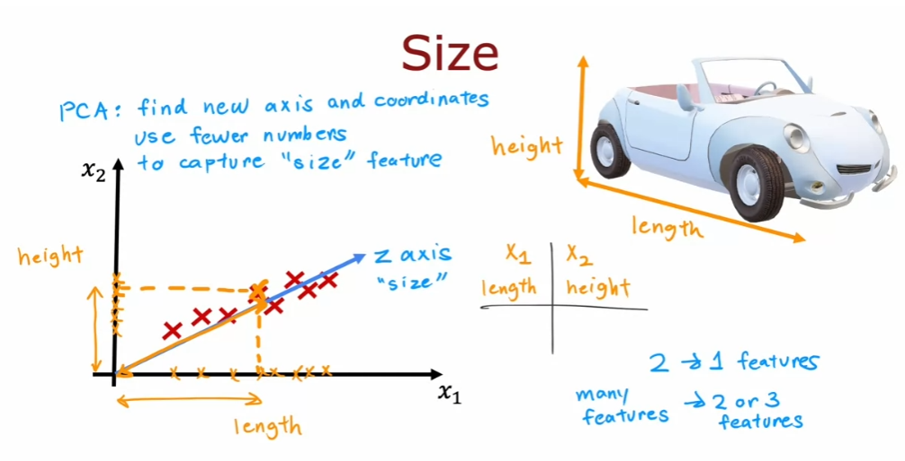
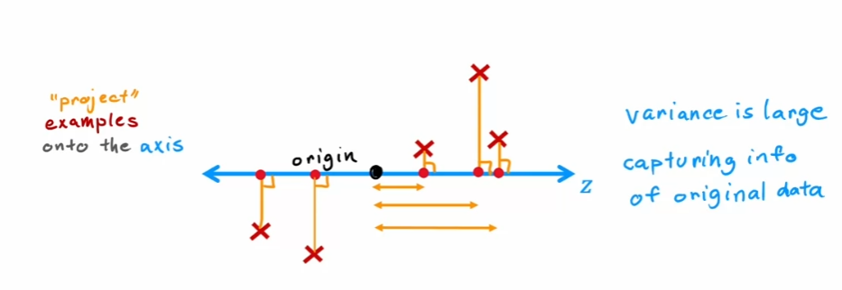
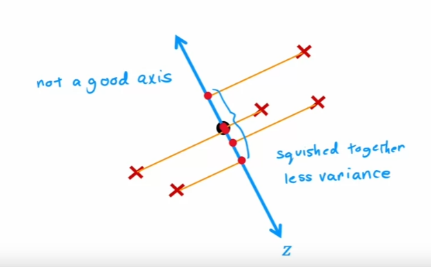
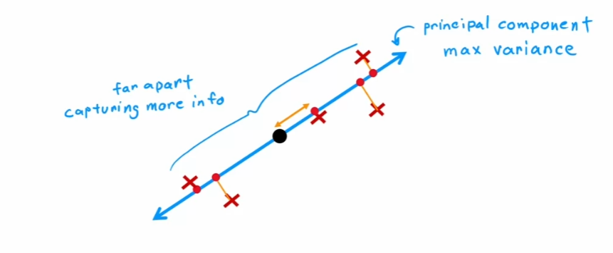
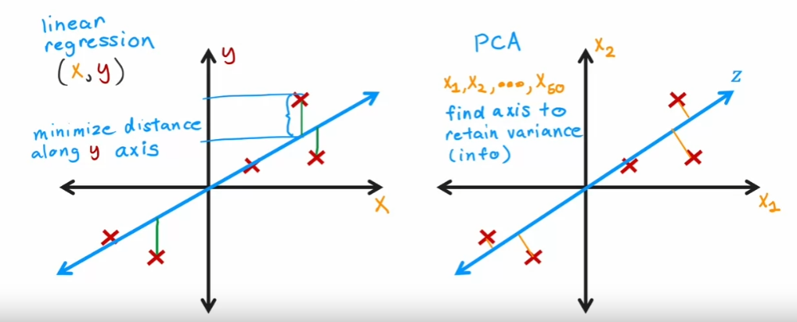

# Principal Component Analysis (PCA)
Principal Component Analysis (PCA) is a powerful unsupervised learning algorithm used primarily for dimensionality reduction and visualization. In scenarios where datasets contain many features (dimensions) that make visualization challenging, PCA assists by compressing these features into fewer dimensions, ensuring the original data's essence remains intact.

## Why PCA?
- **Visualizing High-dimensional Data:** If your dataset comprises numerous features, such as 10, 50, or even thousands, visualizing it becomes a formidable task. PCA provides an elegant solution by reducing these features to just two or three, enabling easy plotting and visualization.

- **Understanding Data Structure:** By projecting the data into a lower-dimensional space, PCA can often reveal hidden structures or patterns that might be harder to discern in the higher-dimensional space.

## PCA Algorithm
PCA is a linear dimensionality reduction technique that seeks to maximize the variance of the projected data. The algorithm works by identifying the hyperplane that lies closest to the data and then projecting the data onto it.

## Choosing the Hyperplane (Axis of Projection or Principal Component)
Consider the following data points in 2D space that we wish to project onto a single dimension. The red line represents the hyperplane that lies closest to the data.

> This is not a bad choice, but it is not the best choice either. The hyperplane should be chosen such that it preserves the maximum amount of variance.

In this case, the `hyperplane` or `principal component` is the line that passes through the origin and bisects the data, maximizing the variance of the projected data. The `principal component` is the direction along which the data varies the most. The `second principal component` is the direction orthogonal to the first principal component that accounts for the next highest variance, and so on.

> This is the worst choice of hyperplane as it squishes the data points together, resulting in a loss of variance.

> This is the best choice of hyperplane as it preserves the maximum amount of variance.

## Projection onto the Hyperplane
Once the hyperplane is chosen, the data is projected onto it. The distance of each data point from the hyperplane is called the `projection` or `loading` of the data point onto the hyperplane. The projection is the dot product of the data point and the unit vector along the hyperplane. The unit vector is the vector that has a magnitude of 1 and points in the direction of the hyperplane. For instance, $(x_1, x_2) = (2, 3)$ and the hyperplane $y = x$, the projection is the dot product of the data point and the unit vector (0.707, 0.707) along the hyperplane.

$$ \text{Projection} = (2, 3) \cdot (0.707, 0.707) = 3.535 $$

## Reconstruction of the Data
The projected data can be reconstructed by reversing the process. The projected data is multiplied by the unit vector along the hyperplane and added to the mean of the original data. The result is the reconstructed data point. Notice that the reconstructed data point is not the same as the original data point but a close approximation.

$$ \text{Reconstruction} = \text{Projection} \cdot \text{Unit Vector} + \text{Mean} $$

$$ (2, 3) \approx 3.535 \cdot (0.707, 0.707) + (0, 0) = (2.52, 2.52) $$

## PCA is not Linear Regression
PCA is often confused with linear regression. However, the two are very different. Linear regression is a supervised learning algorithm that seeks to minimize the error between the predicted and actual values. PCA is an unsupervised learning algorithm that seeks to maximize the variance of the projected data. PCA is not used for prediction but for visualization and dimensionality reduction.

## PCA in Scikit-learn
1. Optional pre-processing: Perform feature scaling to standardize the dataset's features onto unit scale (mean = 0 and variance = 1) to ensure the PCA algorithm's effectiveness.
2. "fit" the PCA algorithm to the data to obtain 2 (or 3) new axes (principal components) that maximize the variance of the projected data.
3. Optionally examine how much variance (information) each principal component captures. This is often referred to as the explained variance ratio.
4. Transform the original data onto the new axes.

## Applications of PCA
- **Visualizing High-dimensional Data:** PCA is often used to visualize high-dimensional data in 2D or 3D. For instance, PCA is used to visualize the MNIST dataset, which comprises 784 features (dimensions), in 2D or 3D.

> **Less Frequently Used Applications**
> - PCA is often used to speed up machine learning algorithms by reducing the number of features. For instance, PCA is used to reduce the number of features in the MNIST dataset from 784 to 154 while preserving 95% of the variance.
> - PCA can be used to filter out noise from datasets. For instance, PCA is used to remove noise from images.