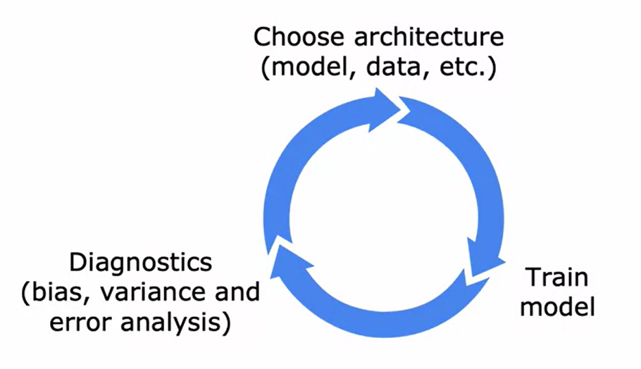

# Machine Learning Development: Iterative Process

Developing a machine learning model often involves an iterative loop:

**1. Decide the architecture of your system:** Choose your machine learning model, decide on what data to use, pick the hyperparameters, etc.

**2. Implement and train a model:** It is important to note that a model almost never works as expected in the first iteration.

**3. Implement diagnostics:** Look at the bias and variance of your algorithm. Based on the insights from these diagnostics, you can then make decisions to improve your model.

**4. Modify the model or data:** Based on the insights from the diagnostics, you can then decide whether you want to change the architecture of your system, add more data, add or subtract features, etc.

**5. Go back to step one** and iterate until you achieve the performance you desire.

The following sections will provide a walkthrough of this process using an example project: building an email spam classifier.

## Email Spam Classifier: Project Description
Email spam is a nuisance for many, and this project aims to mitigate it. The goal is to develop a classifier that can differentiate between spam and non-spam emails. This is an example of text classification, where we use a supervised learning algorithm with features derived from the emails and corresponding labels indicating whether an email is spam or not.

For instance, we could construct a feature vector using the 10,000 most common English words and assign binary values indicating whether a word appears in a given email. Alternative feature construction methods could include counting the number of times each word appears in an email. Once these features are established, a classification algorithm like logistic regression or a neural network can be trained to predict whether an email is spam or not.

## Next Steps
If the initial model's performance isn't as high as desired, you may consider different strategies for improvement. These could involve collecting more data, creating more sophisticated features based on email routing information or the body of the email, or even developing algorithms to detect deliberate misspellings common in spam emails.

However, it can be challenging to determine which strategies are the most promising. Using diagnostics like bias and variance, and performing error analysis can guide you towards more effective modifications to your model. This is the essence of the iterative loop of machine learning development.

## Error Analysis
Error analysis is a process that helps you understand where your model is failing. It involves the following steps:

- **Look at misclassified examples:** From your validation set, find examples that your algorithm has misclassified.
- **Identify common themes:** Go through these misclassified examples and try to identify common properties or traits.
- **Count the categories of errors:** Try to categorize the errors into groups, and count how many errors belong to each category.
- **Prioritize:** Based on this analysis, you can decide which areas need immediate attention and which ones can be deprioritized.

Remember that these categories can overlap, and that you might need to randomly sample a subset of your errors if your validation set is large. The error analysis process can help you gain inspiration for what might be useful to try next and sometimes it can also tell you that certain types of errors are sufficiently rare that they aren't worth as much of your time to try to fix.