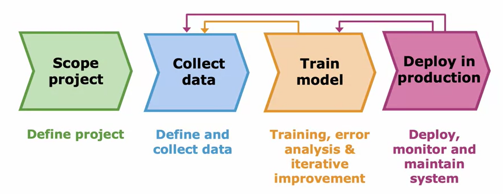
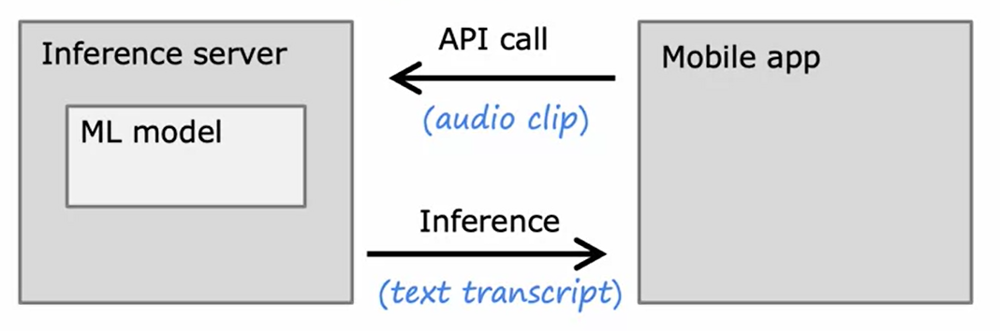

# The Full Cycle of a Machine Learning Project: A Guide
In machine learning projects, training a model is just part of the process. Here, we present the complete lifecycle of a machine learning project, using speech recognition as an example.

## 1. Scoping the Project
The first step in any machine learning project is scoping, i.e., deciding on the specifics of the project. In our case, the project was to develop speech recognition for voice search – enabling web searches using voice commands rather than typing.

## 2. Data Collection
Once you have defined the scope of your project, the next step is to decide what data you need to train your machine learning system. This involves acquiring the necessary audio clips and their respective transcripts to serve as labels for your dataset.

## 3. Model Training
With your initial dataset ready, you can start training your speech recognition system. This process usually involves error analysis and iterative improvements to your model. Sometimes, your analysis might suggest the need for more or specific types of data to improve the performance of your learning algorithm. For instance, you may find your model performs poorly in the presence of car noise in the background and you need more data of that type to enhance its performance.

## 4. Deployment
After sufficient rounds of training and data collection, when you deem your model is ready, you can deploy it in a production environment. Deployment involves making your system available for users. You should also monitor and maintain your system post-deployment, improving it as necessary. If you have user permission, data from your deployed system can even be used to further enhance its performance.

## 5. Deploying in Production

To give you more insight into deployment, here's a typical scenario:

After training a high-performing speech recognition model, you implement it in a server called an "inference server." When a user interacts with a mobile application, the app makes an API call, sending the recorded audio clip to your inference server. The server uses your model to make predictions, in this case, producing the text transcripts of the spoken words.

Depending on the scale of your application, the amount of software engineering required can vary significantly. You'll also want to log the inputs and predictions for system monitoring. This data can be invaluable in identifying when your model's performance is slipping due to shifts in the data, such as when new names or terms enter common usage. Monitoring then allows you to retrain your model and update it accordingly.

## 6. Machine Learning Operations (MLOps)
MLOps, or Machine Learning Operations, is a growing field that focuses on systematically building, deploying, and maintaining machine learning systems. Practices in MLOps ensure your machine learning model is reliable, scales well, has good logging practices, is consistently monitored, and can be updated as needed to maintain its performance.