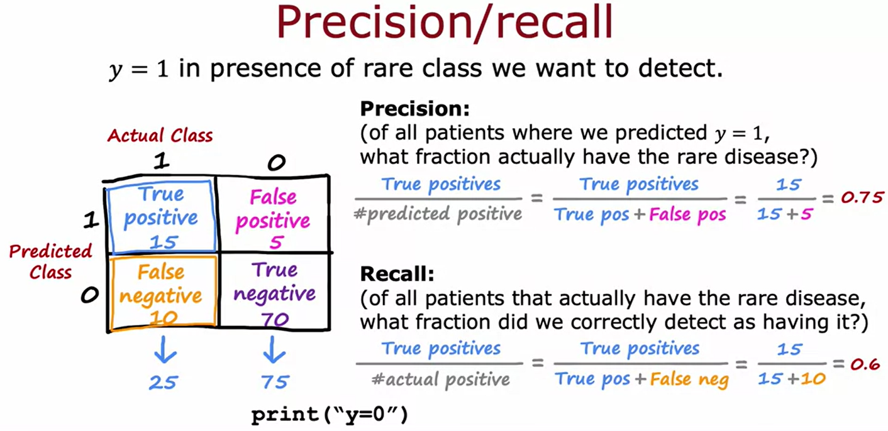
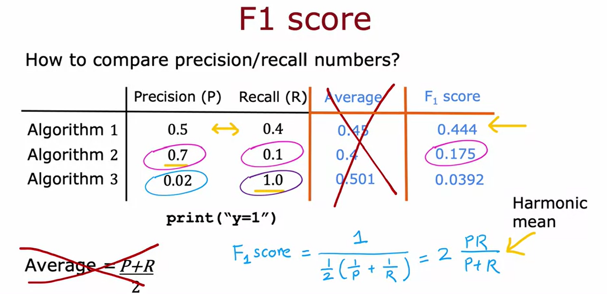

# Evaluating Machine Learning Systems in Skewed Classes
When the ratio of positive to negative examples is very skewed in machine learning applications, traditional error metrics such as `accuracy` may not give meaningful results. Consider an example where we're training a binary classifier to detect a rare disease in patients based on their data. Let's represent presence of the disease as $y = 1$ and absence as $y = 0$.

Assume we've achieved 1% error on the test set, meaning a 99% correct diagnosis rate. This seems impressive, but if only 0.5% of the population have the disease, a naïve classifier that always predicts $y = 0$ would have a 99.5% accuracy. Clearly, the naïve classifier is not a useful diagnostic tool even though it has lower error. 

In skewed datasets, we often use alternative error metrics like     `precision` and `recall`. These are based on a confusion matrix, a 2x2 table with actual classes (1 or 0) on one axis and predicted classes on the other.

The cells of the matrix are:

- True Positives (TP): actual = 1, predicted = 1
- False Positives (FP): actual = 0, predicted = 1
- True Negatives (TN): actual = 0, predicted = 0
- False Negatives (FN): actual = 1, predicted = 0

| | Predicted 1 | Predicted 0 |
| --- | --- | --- |
| Actual 1 | TP | FN |
| Actual 0 | FP | TN |

We define precision and recall as:

- **Precision:** Of all the patients where we predicted y = 1, what fraction actually has the disease.

$$\text{Precision} = \frac{\text{true positives}}{\text{total predicted positives}} = \frac{TP}{TP + FP}$$

- **Recall:** Of all the patients that actually have the disease, what fraction did we correctly detect as having it?

$$\text{Recall} = \frac{\text{true positives}}{\text{total actual positives}} = \frac{TP}{TP + FN}$$

If an algorithm predicts 0 all the time, it will have zero recall and undefined precision. In such a case, we conventionally define precision as zero as well.

Precision and recall help us identify whether our learning algorithm makes useful predictions and can diagnose a reasonable fraction of actual disease cases.

# Precision-Recall Trade-Off
In an ideal world, we want learning algorithms that have high precision and high recall. However, in practice, there's often a trade-off between these two.

## Balancing Precision and Recall
When using logistic regression, we can choose the threshold at which we predict $y=1$ (e.g., the presence of a rare disease). For example, we may choose to predict $y=1$ only when we are 70% sure, rather than 50% sure. Increasing this threshold would increase precision (because we're more likely to be right when we predict 1), but it would decrease recall (since we're predicting 1 less often and may miss some true positives).

Conversely, we could lower this threshold if we want to avoid missing too many cases of the rare disease. Lowering the threshold to say, 30%, would result in higher recall but lower precision.

## Trade-Off Curve
The "best" threshold will depend on the specific costs and benefits of false positives versus false negatives, high precision versus high recall. This choice cannot be made through cross-validation but rather, has to be made based on the specific needs and constraints of the application.

## F1 Score: Combining Precision and Recall
In cases where we want an automatic way to balance precision and recall, we can use the F1 score. This is a metric that combines precision and recall, with more emphasis on whichever is lower. The F1 score is calculated using the following formula:

$$\text{F1} = \frac{1}{\frac{1}{2}(\frac{1}{\text{P}} + \frac{1}{\text{R}})} = \frac{2 \cdot \text{P} \cdot \text{R}}{\text{P} + \text{R}}$$

The F1 score is also known as the `harmonic mean of precision and recall`. The higher the F1 score, the better the balance between precision and recall.
