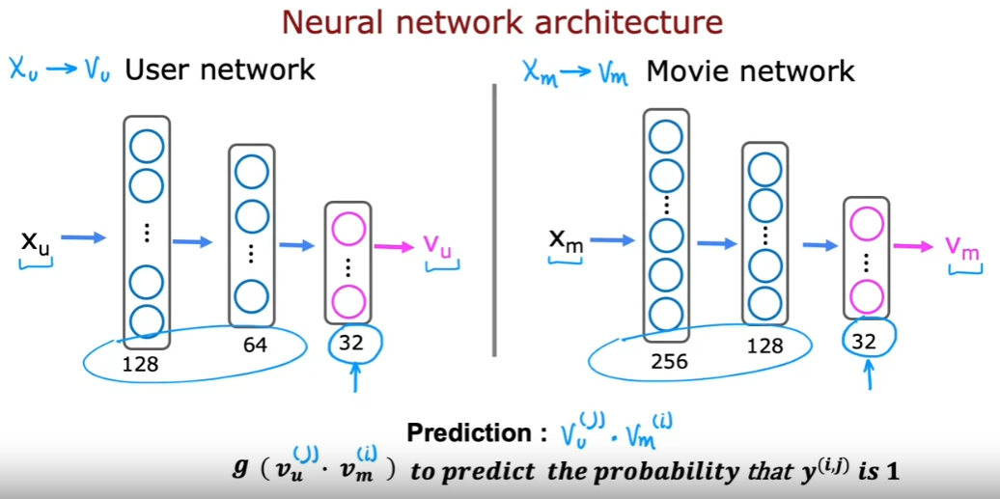
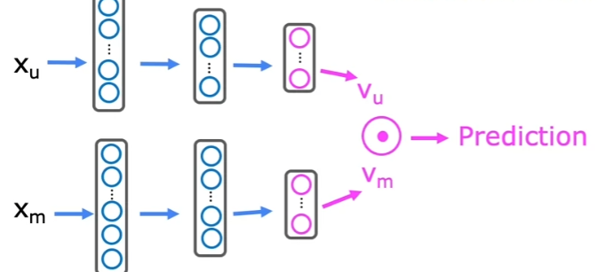

# Contect-Based Filtering
Content-based filtering is a technique used to recommend items based on their similarity to other items. In contrast, collaborative filtering (CF) is a technique that recommends items based on the similarity of users’ preferences.

| Collaborative Filtering | Content-Based Filtering |
| --- | --- |
| Recommend items to you based on ratings of users who gave similar ratings as you | Recommend items to you based on features of user and item to find a good match |

## Examples of user and item features
| User Features $x_u^{(j)}$ for user $j$ | Item Features $x_m^{(i)}$ for movie $i$ |
| --- | --- |
| Age | Genre |
| Gender | Director |
| Location | Actor |
| Occupation | Year |
| Avg rating per genre | Avg rating |

## Content-Based Filtering: Learning to Match
Previously, we used the following model to predict the rating of movie $i$ by user $j$:

$$w^{(j)} \dot x^{(i)} + b^{(j)}$$

In content-based filtering, we will use the following model to predict the rating of movie $i$ by user $j$:

$$V_u^{(j)} \dot V_m^{(i)}$$

> It turns out that omitting the bias term $b^{(j)}$ does not affect the performance of the model.

where $V_u^{(j)}$ is the feature vector for user $j$ computed from the user features $x_u^{(j)}$ and $V_m^{(i)}$ is the feature vector for movie $i$ computed from the movie features $x_m^{(i)}$. Notice that the dimensions of $x_u^{(j)}$ and $x_m^{(i)}$ may be different, but the dimensions of $V_u^{(j)}$ and $V_m^{(i)}$ are the same.

$$V_u =
\begin{pmatrix}
4.9 \quad (likes) \\
0.1 \quad (likes) \\
... \\
3.0 \quad (likes)\\
\end{pmatrix}$$

$$V_m =
\begin{pmatrix}
4.5 \quad (romance) \\
0.2 \quad (action) \\
... \\
3.5 \quad (comedy) \\
\end{pmatrix}$$

We could interpret the dot product $V_u^{(j)} \dot V_m^{(i)}$ as the similarity between the user and the movie. In this case, the user likes romance movies and the movie is a romance movie, so the dot product will be high ($4.9 \times 4.5 = 22.05$). If the user likes romance movies and the movie is an action movie, then the dot product will be low ($4.9 \times 0.2 = 0.98$).

## Neural Network Architecture
A good way to develop a content-based filtering model is to use a neural network. The neural network architecture is as follows:

Here's we have drawn two separate networks: a user network and a movie network. The user network takes in the user features $x_u^{(j)}$ and outputs the user feature vector $V_u^{(j)}$. The movie network takes in the movie features $x_m^{(i)}$ and outputs the movie feature vector $V_m^{(i)}$. The user and movie feature vectors are then fed into a dot product layer, which outputs the predicted rating $\hat{y}^{(i,j)}$.

We can actually draw the user and movie networks as one network:

The upper half of the network is the user network and the lower half of the network is the movie network. 

## Cost Function

$$J = \frac{1}{2} \sum_{(i,j):r(i,j)=1} \left( V_u^{(j)} \dot V_m^{(i)} - y^{(i,j)} \right)^2 + \text{NN regularization term}$$

where $r(i,j) = 1$ if user $j$ has rated movie $i$ and $r(i,j) = 0$ otherwise.

## Learned Features
- $v_u^{(j)}$ is a vector that represents user $j$'s preferences with features $x_u^{(j)}$.
- $v_m^{(i)}$ is a vector that represents movie $i$'s features with features $x_m^{(i)}$.

To find movies similar to movie $i$, we can find movies $k$ that minimize the distance between $v_m^{(i)}$ and $v_m^{(k)}$ (i.e. $||v_m^{(i)} - v_m^{(k)}||^2$ is small).

> Note that this can be pre-computed and stored in a database so that we don't have to compute this every time we want to find similar movies.

## Recommending from a large catalogue
If we have a large catalogue of movies, running the dot product layer for every movie would be very expensive. Instead, we can use the two steps: `Retrieval & Ranking`:

**Retrieval**:
- Generate a large list of plausible candidates (e.g. 1000 movies)
    - For each of the last 10 movies watched by the user, find the 20 most similar movies
    - For most viewed 3 genres, find the top 10 movies
    - For each of the 5 most viewed directors, find the top 10 movies
    - Top 20 movies in the country
- Combine retrieved items into a list, remove duplicates, and remove already watched / purchased items

**Ranking**:
- Take list retrieved and rank using learned model (e.g. dot product layer)
- Display ranked items to user

> Retrieving more items results in better performance, but slower recommendations. To analyze/optimize the trade-off, carry out offline experiments to see if retrieving additional items results in more relevant recommendations.
