# Decision Trees
Decision trees are a powerful and versatile machine learning model, which is based on simple decision rules that are inferred from the data set.

Decision trees can be used for various types of learning tasks (e.g., classification, regression, ranking), and they can handle different types of data (e.g., numerical and categorical data).

**Definition:** A decision tree is a tree in which each internal (non-leaf) node is labeled with an input feature and the edges coming out of it are labeled with each of its possible values. Each leaf node is labeled with one of the classes.

There are two main types of decision trees:

1. Classification trees are used to predict the class to which a sample belongs.
2. Regression trees are used when the target variable is a continuous-valued number.

## Building a Decision Tree
A decision tree is built in a top-down, greedy fashion. Initially, the root node of the tree contains all the samples in the training set. In every node of the tree, we split the training samples into two or more subsets based on one of the attributes. This process is repeated recursively on each child node. The recursion ends when all the samples at a node belong to the same class, or when there are no more features that can be used for splitting the node. Some decision tree learning algorithms allow only binary splits while others allow multi-way splits.

## Splitting Criteria
A good attribute splits the examples into purer subsets, i.e., subsets that are more homogenous in their class labels than the set of examples in the parent node. Ideally, there is an attribute that splits the examples into two completely pure subsets: a subset of "all positives" and a subset of "all negatives". In other cases, we need to define a node impurity measure that will allow us to compare the quality of the splits of different attributes. The two most common measures of node impurity are `entropy` and `Gini index`.

## Entropy
Entropy of a random variable is a measure of the uncertainty in the variable's possible outcomes. The more uncertain we are about the value of the variable, the higher its entropy.

Formally, Let $X$ be a random variable with possible values $\{x_1, x_2, \dots, x_n\}$ and let's denote the probability of $x_i$ by $p(x_i)$. The entropy of $X$ is defined as:

$$H(X) = -\sum_{i=1}^{n} p(x_i) \log_2 p(x_i)$$

Note that if $p(x_i) = 0$ then we define $0 \log_2 0 = 0$ (this is the standard convention in information theory).

For example, let $X$ be a random variable that represents the outcome of a fair coin toss. The possible values of $X$ are $\{H, T\}$ and $p(H) = p(T) = 0.5$. The entropy of $X$ is:

$$H(X) = -0.5 \log_2 0.5 - 0.5 \log_2 0.5 = 1$$

On the other hand, if the coin is biased and $p(H) = 0.8$, then the entropy of $X$ is:

$$H(X) = -0.8 \log_2 0.8 - 0.2 \log_2 0.2 = 0.72$$

The entropy of $X$ became smaller, since we have less uncertainty about the outcome of the coin toss. Every time we toss the coin, we are more likely to get heads than tails. We can actually plot the entropy of $X$ as a function of $p(H)$:

    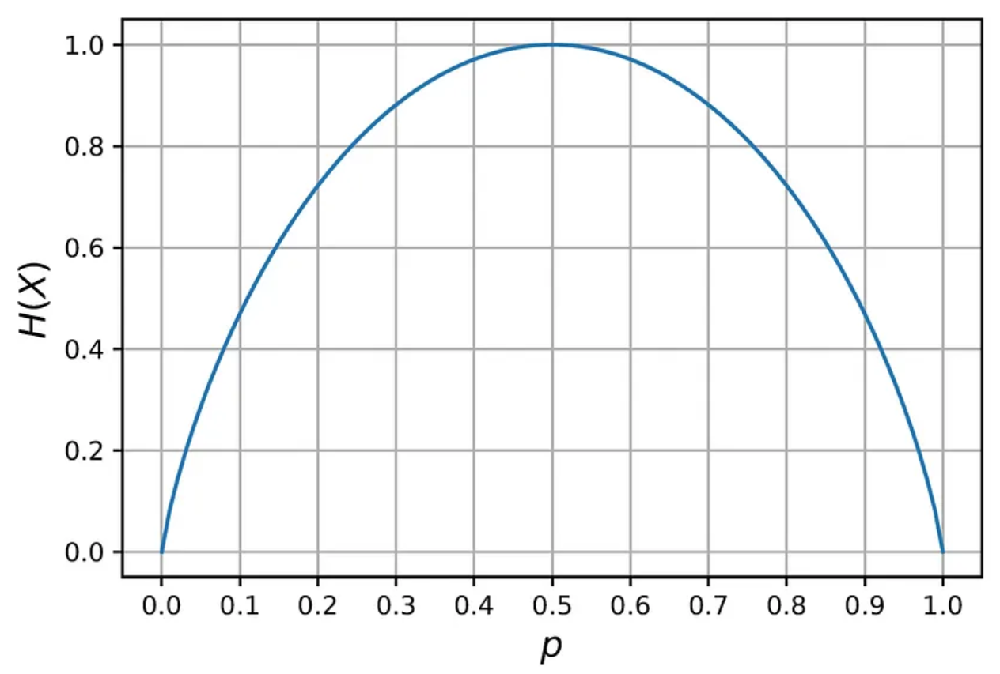

> Uniform probability $(p = 0.5)$ corresponds to the maximum entropy. As we move away from uniform probability towards $p = 0$ or $p = 1$, the entropy decreases since we have more information about the outcome of the $X$.

## Entropy in Decision Trees
Suppose that we have a classification problem with $k$ classes: $\{c_1, c_2, \dots, c_k\}$. Let the fraction of training samples in nove $v$ that belongs to class $c_i$ be $P(c_i|v)$. This quantity represents the probability that a sample that reaches node $v$ belongs to class $c_i$. The entropy of node $v$ is defined as:

$$H(v) = -\sum_{i=1}^{k} P(c_i|v) \log_2 P(c_i|v)$$

$H(v)$ measures the uncertainty that we have regarding the class label of the samples in node $v$, or the homogeneity of the class labels in $v$. 

For example, assume that we have three classes, and a node $v$ that contains 10 samples, 2 of which belong to class $c_1$, 4 to class $c_2$, and 4 to class $c_3$. The entropy of $v$ is:

$$H(v) = -\frac{2}{10} \log_2 \frac{2}{10} - \frac{4}{10} \log_2 \frac{4}{10} - \frac{4}{10} \log_2 \frac{4}{10} = 1.522$$

In the extreme case, when all the samples in $v$ belong to the same class, the entropy of $v$ is 0. For example, if all the 10 samples in $v$ belong to class $c_1$, then $P(c_1|v) = 1$ and $P(c_i|v) = 0$ for $i \neq 1$, and the entropy of $v$ is:

$$H(v) = -1 \log_2 1 - 0 \log_2 0 - 0 \log_2 0 = 0$$

On the other hand, when the samples are equally distributed among all the classes, we have the least amount of information about the class label in that node. Hence, $v$ is the most impure, and its entropy is the highest. 

$$H(v) = -\sum_{i=1}^{k} \frac{1}{k} \log_2 \frac{1}{k} = \log_2 k$$

For example, if we have 10 samples in $v$ and 3 classes, then the maximum entropy is $\log_2 3 = 1.585$.

## Information Gain
To determine how well a test condition works at node $v$, we need to compare the entropy of $v$ before the split with the entropy of its child nodes after the split.

**Information gain** measures the reduction in entropy at node $v$ after splitting it into child nodes $v_1, v_2, \dots, v_k$. Formally, let $n$ be the number of training samples in node $v$, and let $n_i$ be the number of training samples in child node $v_i$. The information gain of node $v$ is defined as:

$$IG(v) = H(v) - \sum_{i=1}^{k} \frac{n_i}{n} H(v_i)$$

In other words, information gain is the difference between the entropy at the parent node $v$ and the weighted average of the entropies at the child nodes $v_1, v_2, \dots, v_k$, where the weight of each child node is the fraction of samples that went from the parent node to that node.

    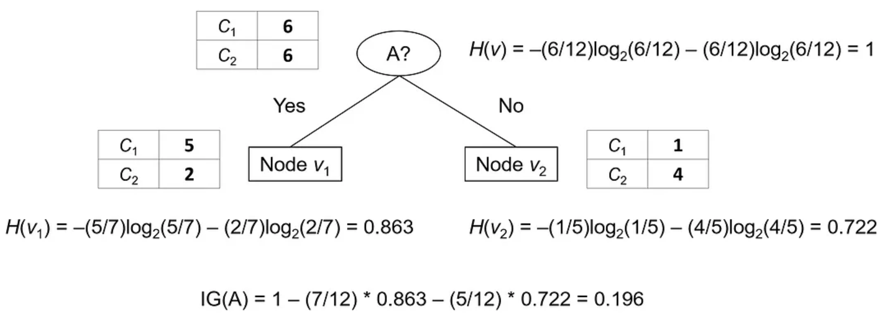

Our goal is to find an attribute that maximizes the information gain, i.e., an attribute that achieves the highest reduction in the entropy. This means that in every node of the tree, we need to go over all the attributes and compute for each one its information gain.

## Gini Index
Gini index (or Gini impurity) is an alternative measure for node impurity. It measures how often a randomly chosen sample at a given node would be incorrectly labeled if it were labeled randomly according to the distribution of the classes at that node. When the class distribution is more heterogenous, the probability of such misclassification increases, and as a result the Gini index of that node becomes higher.

Formally, let ${p_1, p_2, \dots, p_k}$ be the relative frequencies of the classes at a given node $v$. Then, the probability of misclassifying a sample that belongs to class $i$ is:

$$\sum_{j \neq i} p_j = 1 - p_i$$

The Gini index is computed by summing pairwise products of these probabilities for each class:

$$G(v) = \sum_{i=1}^{k} p_i \sum_{j \neq i} p_j = \sum_{i=1}^{k} p_i (1 - p_i) = \sum_{i=1}^{k} p_i - \sum_{i=1}^{k} p_i^2 = 1 - \sum_{i=1}^{k} p_i^2$$

That is, the Gini index is the sum of the squares of the class probabilities subtracted from 1.

For example, assume that a node $v$ contains 10 samples, 2 of which belong to class $c_1$, 4 to class $c_2$, and 4 to class $c_3$. The Gini index of $v$ is:

$$G(v) = 1 - \left(\frac{2}{10}\right)^2 - \left(\frac{4}{10}\right)^2 - \left(\frac{4}{10}\right)^2 = 0.64$$

<i>Practice has shown that there is no much difference in the performance of decision trees when using Gini index instead of entropy. However, Gini index is sometimes preferred because its computation is a bit faster (since it doesn't involve any logarithm computations).</i>

## Decision Tree Construction
Assume that we have the following data set with information on 14 employees in some fictitious company:

    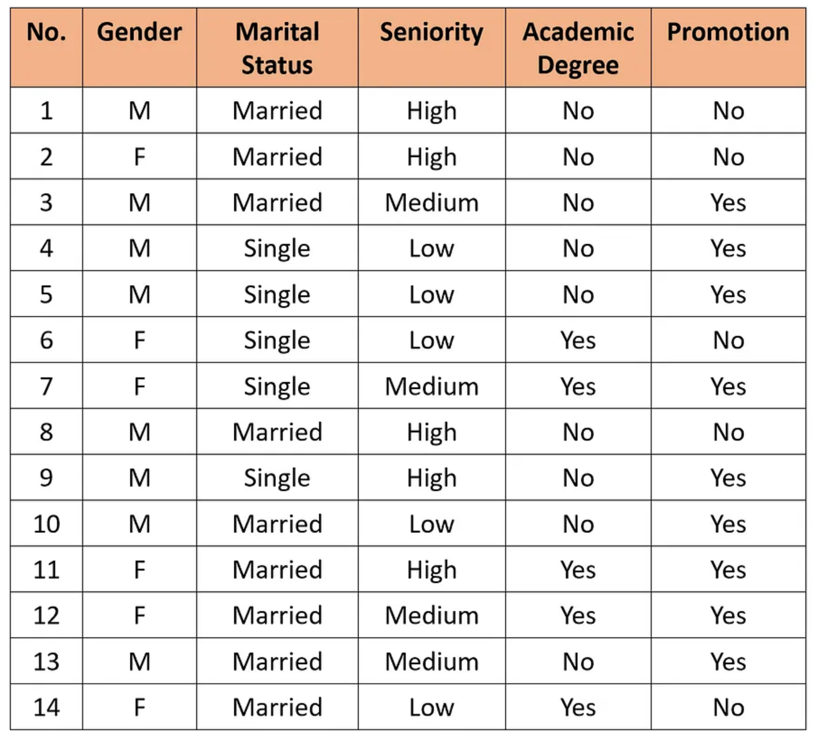

Our objective is to predict whether an employee will get a promotion based on four attributes: the employee's gender (Male or Female), marital status (Single or Married), seniority at the workplace (Low, Medium or High), and whether they have an academic degree (Yes or No).

First, we need to select the attribute for the first split at the root node. To that end, we compute the information gain for each of the four attributes:

    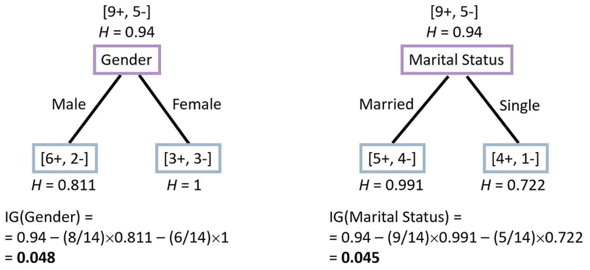

> Information gain of Gender and Martital Status

    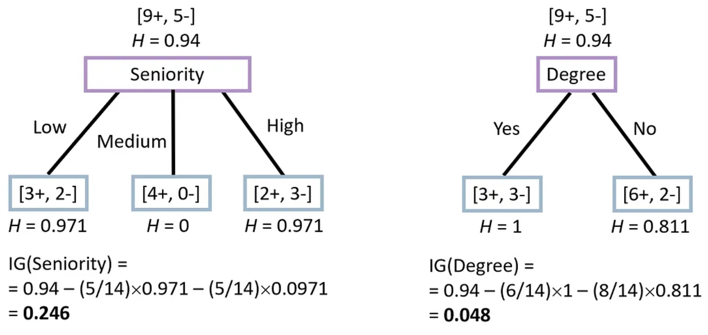

> Information gain of Seniority and Degree

The Seniority attribute leads to the highest information gain, therefore we use it for the split at the root of the tree. The training samples are then split into three subsets according to their value in the Seniority attribute:

    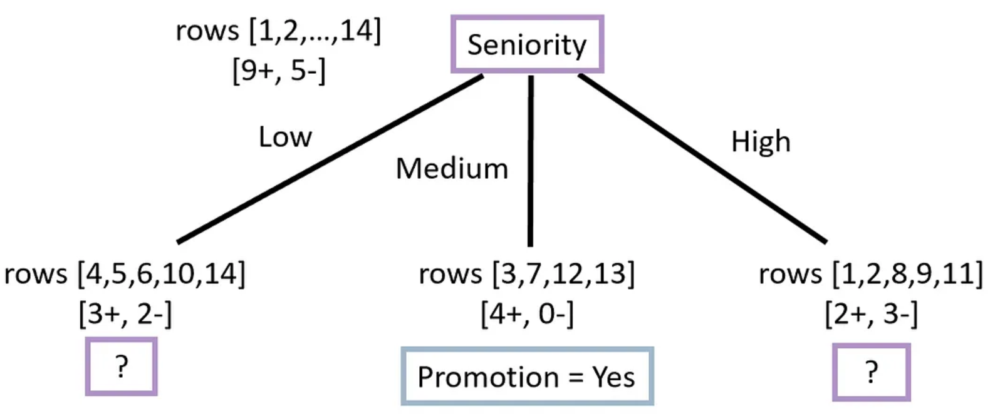

> The second child node (the one that corresponds to Seniority = Medium) doesn't need any further splitting, since all the samples in that node have the same label (Promotion = Yes), so we can turn it into a leaf node with that label.

Let's now handle the left child node (the one that corresponds to Seniority = Low). The records that belong to this node are:

    

> We can clearly see that there is a total correspondence between the attributes Gender and Academic Degree and the Promotion label, so we can select either of these attributes for our split. For example, if we choose the Gender attribute, we will get the following tree:

    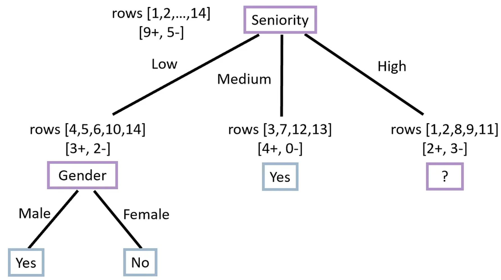

Now, we need to take care of the third child node (the one that corresponds to Seniority = High). Let's look at the records that belong to this node:

    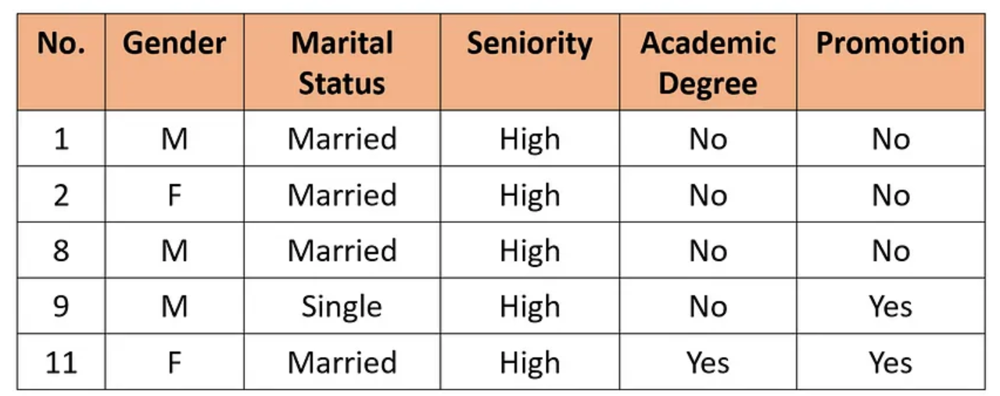

> This time there is no attribute that has a total correspondence with the label, so we need to compute the information gain for all the attributes in this node except for Seniority (which was already used at the root node).

    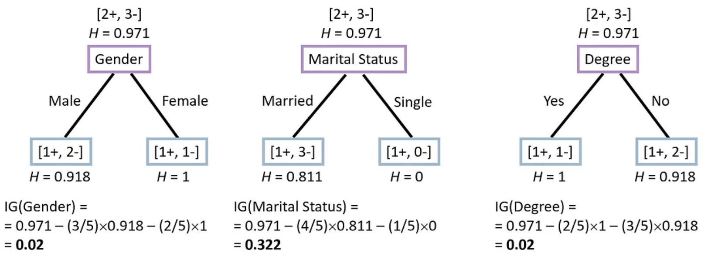

> The attribute Marital Status leads to the highest information gain, so we will use it for the split. Hence, we get the following tree:

    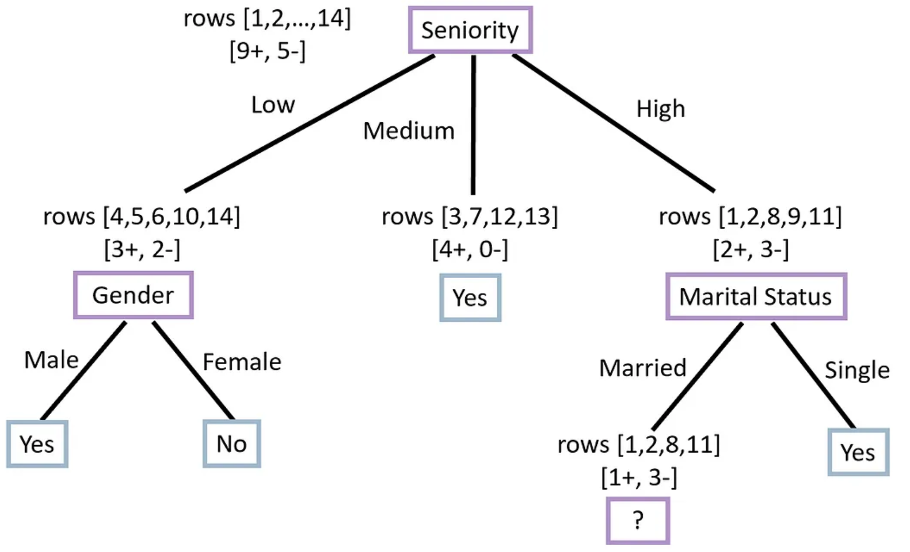

Lastly, we need to classify the four samples that belong to Seniority = High and Marital Status = Married. Only one of these samples has Promotion = Yes (sample no. 11), and the other three have Promotion = No. If we examine the Degree column, we can see that only sample no. 11 has Degree = Yes, and all the other three have Degree = No. Therefore, we can use the Degree attribute to correctly classify all the four samples.

Therefore, the final decision tree is:

    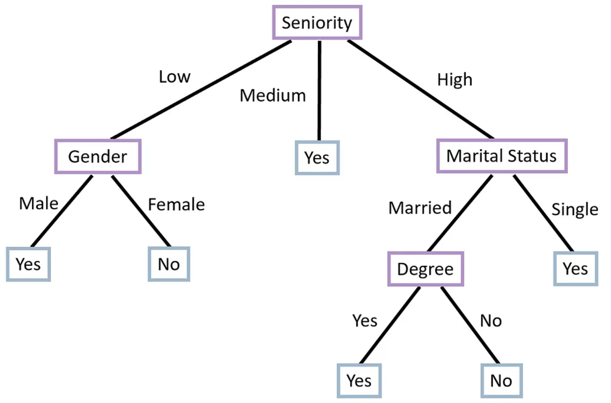

This tree classifies all the samples in our training set perfectly!

By constructing the entire tree and splitting all the nodes until we are left with only leaf nodes, we can almost always get a tree that has 100% accuracy on the training set (unless we have two samples with exactly the same attribute values but different labels). However, such trees usually suffer from overfitting and have poor performance on the test set.

## Time Complexity
Let $n$ be the number of training samples and $m$ be the number of attributes. For the sake of simplicity, we will assume that all the features are continuous valued.

The time complexity of building a decision tree is:

- In each node of the tree, for each continuous feature we need to sort the values of the training samples according to that feature, which takes in the worst case $O(n \log n)$ time. After the sort, we linearly scan the values in order to find the best splitting point, which takes only $O(n)$ time. Therefore, the total time complexity for finding the best split in a node is $O(m n \log n)$.

- The decision tree contains $O(n)$ internal nodes, since in a fully-grown tree each leaf node contains exactly one sample, thus the number of leaves is $n$. We also know that in a full binary tree (a binary tree where each internal node has exactly two child nodes), the number of leaves is one more than the number of internal nodes. Therefore, the number of internal nodes in a decision tree is at most $n - 1$. Hence, the total time complexity for building the decision tree is $O(m n^2 \log n)$.
