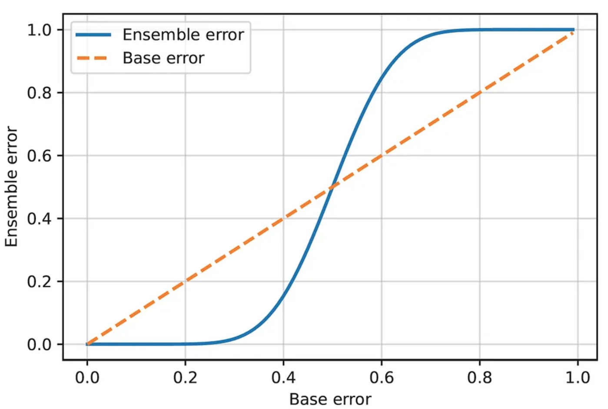
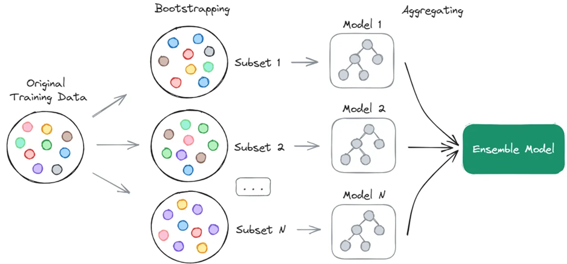
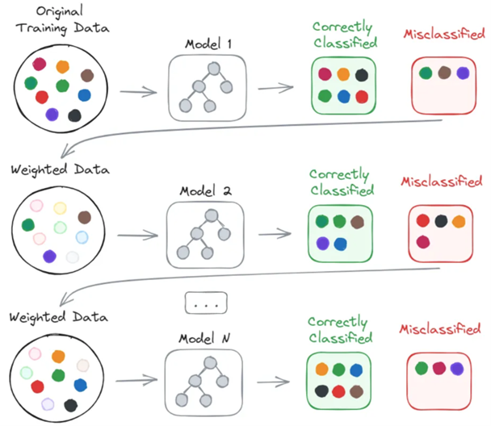

# Ensemble Methods
An ensemble method is a powerful technique that allows us to combine multiple machine learning models into one model, which often performs better than any of the individual models alone.

## Why Creating an Ensemble is a Good Idea?
Assume that we have an ensemble of $n$ classifiers, each of which has an error rate of $\epsilon$. We also assume that the ensemble uses a majority voting on the classifiers' predictions to make its final prediction.

Let's try to compute the error rate of the ensemble in this case. First, we denote the number of classifiers that made a wrong prediction by $k$ (out of $n$ classifiers). 

If the base classifiers are independent (i.e., their errors are uncorrelated), then the variable $k$ follows a binomial distribution with parameters $n$ and $\epsilon$, that is, $k \sim Bin(n, \epsilon)$, since each prediction is a Bernoulli trial with probability $\epsilon$ of success. The ensemble will make a wrong prediction only if at least half of the base classifiers are wrong (since it uses a majority voting). Therefore, according to the Binomial probability distribution, the error rate of the ensemble is:

$$\epsilon_{ensemble} = P(k \geq \frac{n}{2}) = \sum_{i=\frac{n}{2}}^{n} \binom{n}{i} \epsilon^i (1-\epsilon)^{n-i}$$

For example, if we have 25 base classifiers, each with an error rate of 0.25, then the error rate of the ensemble would be:

$$\epsilon_{ensemble} = \sum_{i=13}^{25} \binom{25}{i} 0.25^i 0.75^{25-i} = 0.0034$$

The error rate of the ensemble is much lower than the error rate of the base classifiers (0.25). This is because the base classifiers are independent, and the ensemble makes a wrong prediction only if at least half of the base classifiers are wrong.

We can actually plot a graph of the ensemble error rate as a function of the base error rate $\epsilon$ (assuming that we have 25 base classifiers):

    

We can see that the turning point is at $\epsilon = 0.5$, which means that if the base classifiers are no better than random guessing, then the ensemble will not perform better than random guessing. However, if the base classifiers perform better than random guessing, then the ensemble will perform better than the base classifiers.

From the above discussion we can learn that there are two conditions under which the ensemble performs better than the individual classifiers:

1. The base classifiers should be independent of each other. In practice, it is difficult to ensure total independence between the classifiers. However, practice has shown that even when the classifiers are partially correlated, the ensemble can still perform better than any one of them.
2. Each base classifier should have an error rate of less than 0.5, i.e., it should perform better than a random guesser. A model that performs only slightly better than a random guesser is called a weak learner. As we have just shown, an ensemble of many weak learners can become a strong learner.

## Voting
A simple way to aggregate the predictions of the base models in the ensemble is by using voting. Each base model makes a prediction and votes for each sample. Then the ensemble returns the class with the highest votes.

1. Majority Voting: The ensemble selects the class with the highest number of votes.
2. Weighted Voting: Each base model is assigned a weight, and the ensemble selects the class with the highest sum of weights.
3. Soft Voting: The ensemble selects the class with the highest average predicted probability.

## Bagging (Bootstrap AGGregatING)
Bagging is a technique that directly leverages the concept of bootstrapping to create and train a weak learner on each of the individual subsets (sometimes referred to as “bags”). A weak learner in this context is defined as an algorithm that performs just slightly better than random guessing.
- Bagging is a parallel process, meaning that the models are created in parallel on these subsets and are independent of one another.
- After fitting a model to each of the bootstrapped subsets, their respective results are combined, or aggregated, in order to obtain the final results.

    

- For regression tasks, the final prediction is typically the average of the predictions made by all the individual weak learners in the ensemble. Since the goal of a regression task is to predict a continuous output, taking the average can help to reduce variance and improve the overall performance of the ensemble.
- For classification tasks, the final prediction is typically made by majority voting, where each individual weak learner votes for one class, and the class with the most votes is chosen as the final prediction.

## Implementations of Bagging:
- **Random Forest:** Random forests train an ensemble of decision trees (estimators), with each tree being fit on a bootstrapped subset of data. In addition, a random subset of the features is selected at each split in the decision tree. This additional randomization helps to de-correlate the trees, leading to lower variance and better generalization ability.
- **Extra Trees:** Extremely randomized trees, or extra trees, are a modification of random forests. In addition to bootstrapping and random feature subsets, the decision thresholds for the features are also randomized, which introduces even more diversity among the trees.
- **Bagging Classifier/Regressor:** These are general bagging wrappers available in libraries like scikit-learn. For example, you can use this wrapper to create a bagging classifier or regressor based on a support vector machine or k-nearest neighbors, not just decision trees.

## Boosting
Boosting generally does not make use of bootstrapping and follows a sequential process, where each subsequent model tries to correct the errors of the previous model and reduce its bias.
- First, a weak learner is fitted on the original training data and subsequently evaluated by comparing its predictions to the actual values. During this initial iteration, all samples are given equal weights.
- Next, we increase the weights of the misclassified samples and decrease the weight of the correctly classified ones. The samples that were misclassified will thus have higher weights in the next iteration, thereby “boosting” their importance.
- This process is then repeated for a pre-defined number of iterations, or until the models’ predictions reach a desired level of accuracy. Once all the models are trained, their predictions are combined to produce the final output. Typically, the prediction of each individual model is weighted based on its accuracy, with more accurate models contributing more to the final prediction.

    

## Implementations of Boosting:
- **AdaBoost:** Adaptive boosting, or AdaBoost, starts by training a weak learner on the entire training set. It then evaluates it and assigns it a performance score depending on the model’s error. Next, it trains additional learners on the same dataset but with increased weights for the instances that were misclassified (or suffered from large prediction errors) by the previous learners. Finally, to make a prediction, AdaBoost combines the weak learners with each model’s vote weighted by its performance score.
- **Gradient Boosting:** This method is a generalization of boosting to arbitrary differentiable loss functions. Instead of tweaking sample weights like AdaBoost, gradient boosting fits each new learner to the residual errors (differences between the predicted and actual values) of the previous learner. You can think of it as a way of “correcting” the previous learners’ mistakes in the direction that minimally reduces the overall error. Eventually, the predictions of all learners are added up to make a final prediction.
- **XGBoost:** Extreme gradient boosting, or XGBoost, is a highly optimized implementation of gradient boosting that is designed to be more efficient and flexible than the standard version. While the steps for training a model are the same as for gradient boosting, it includes additional features such as regularization parameters to prevent overfitting, the ability to handle missing values, and an algorithm that helps to effectively find optimal splits in the data.
