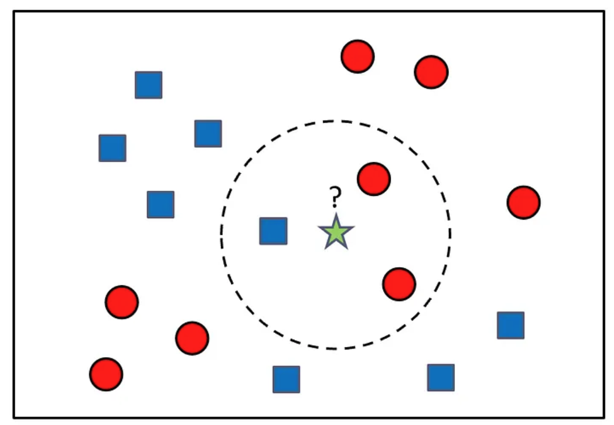
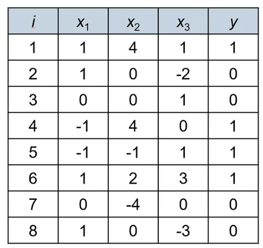
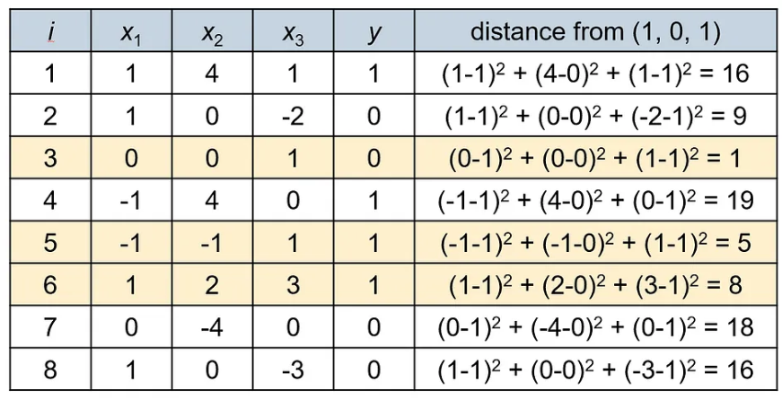

# K-Nearest Neighbors (KNN)
The K-nearest neighbors algorithm (KNN) is a very simple yet powerful machine learning model. It assigns a label to a new sample based on the labels of its $k$ closest samples in the training set.

KNN is a **lazy learner:** it does not build a model from the training data, and all of its computation is deferred until the prediction time.

Despite its simplicity, it provides one of the best performances in many real-world data sets. KNN is also a very flexible model: it can find decision boundaries of any shape between the classes, and can be used for both classification and regression problems.

## K-Nearest Neighbors Classification
The idea behind the KNN classification algorithm is very simple: given a new sample, assign it to the class that is most common among its $k$ nearest neighbors.

    

The training phase of the algorithm consists of only storing the training samples and their labels, i.e., no model is built from the data. In the prediction phase, we compute the distances between the test (query) point $x$ and all the stored samples, find the $k$ samples with the smallest distances, and assign the majority label of these samples to $x$.

### Numerical Example
Let's consider the following data set:

    

Classify the vector $(1, 0, 0)$ using the KNN algorithm with $k = 3$ and the Euclidean distance.

We first compute the distance from $(1, 0, 1)$ to each one of the given points. The Euclidean distance between two vectors $x = (x_1, \cdots, x_n)$ and $y = (y_1, \cdots, y_n)$ is defined as:

$$d(x, y) = \sqrt{\sum_{i=1}^n (x_i - y_i)^2}$$

Since we are only interested to find the closest points to $(1, 0, 1)$, we can save some computations by computing the Euclidean distance squared (i.e., not taking the square root in the equation above).

    

From the table above we can see that the three closest points to $(1, 0, 1)$ are points $3, 5$ and $6$. The majority class of these points is $1$, therefore $(1, 0, 1)$ will be classified as $1$.