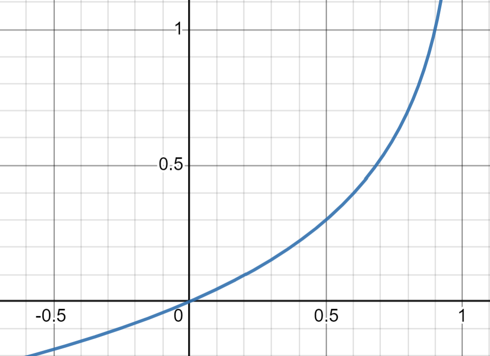

# Logistic Regression
Logistic regression is one of the most common machine learning algorithms. It can be used to predict the probability of an event occurring, such as whether an incoming email is spam or not, or whether a tumor is malignant or not, based on a given labeled data set.

The model has the word "logistic" in its name, since it uses the logistic function (sigmoid) to convert a linear combination of the input features into probabilities. It also has the word "regression" in its name, since its output is a continuous value between 0 and 1, although it is typically used as a binary classifier by choosing a threshold value (usually 0.5) and classifying inputs with probability greater than the threshold as the positive class, and those below the threshold as the negative class.

Logistic regression is a probabilistic classifier that handles binary classification problems. Given a sample $(x, y)$, it outputs a probability $p$ that the sample belongs to the positive class:

$$p = P(y=1|x)$$

If this probability is higher than some threshold value (typically chosen as 0.5), then the sample is classified as 1, otherwise it is classified as 0.

<i>How does the model estimate the probability p?</i>

## Log-Odds
Out of 10 students, 8 of them passed the exam and 2 of them failed. The probability of passing the exam is 0.8 and the probability of failing the exam is 0.2. Alternatively, the `odds` of passing the exam is 4 (0.8/0.2). The formula for odds is:

$$odds = \frac{p}{1-p}$$

where $p$ is the probability of success. The formula for probability is:

$$p = \frac{odds}{1+odds}$$

**Odds Ratio (OR)** is the ratio of the odds of success in one group to the odds of success in another group. The formula for odds ratio is:

$$odds_{ratio} = \frac{odds_{group_1}}{odds_{group_2}}$$

Note that:
- $0 < p < 1$
- $0 < odds < \infty$
- $0 < odds\_ratio < \infty$
- $-\infty < ln(odds) < \infty$
- If $O = 1$, then $p = q = 0.5$
- $O_{success} = \frac{1}{O_{failure}}$

The simple logistic regression model is used to model probability that the response variable Y belongs to a particular category of two possible categories. Given a set of predictors $X_1, X_2, ..., X_n$, the model estimates the probability that $Y = 1$ given the values of $X_1, X_2, ..., X_n$. An inital thought might be to use linear regression to model the probability of $Y = 1$:

$$P(Y=1|X) = \beta_0 + \beta_1X + \beta_2X + ... + \beta_nX + \epsilon$$

However, this model is not appropriate because the left-hand side of the equation is a probability, and probabilities must always be between 0 and 1; while the right-hand side of the equation can take on any real value. Therefore, we must model $P(Y=1|X)$ using a function that gives outputs between 0 and 1 for all values of $X$.

We transform the left-hand side of the equation using the `logit function`:

$$P(Y=1|X) \in [0,1] \rightarrow Odds \in [0,\infty] \rightarrow ln(Odds) \in [-\infty,\infty]$$

Where the logit function is defined as:

$$ln(odds) = ln(\frac{p}{1-p}) = logit(p)$$

We assume here that the base of the logarithm is e (i.e., natural logarithm), although other bases can be used as well.

    

As can be seen, the logit function maps probability values in (0, 1) into real numbers in (-$\infty$, $\infty$). Therefore, following these transformations, the model becomes:

$$ln(\frac{p}{1-p}) = \beta_0 + \beta_1X + \beta_2X + ... + \beta_nX + \epsilon$$

$$p = \frac{e^{(\beta_0 + \beta_1X + \beta_2X + ... + \beta_nX)}}{1+e^{(\beta_0 + \beta_1X + \beta_2X + ... + \beta_nX)}}$$

Let $Z = \beta_0 + \beta_1X + \beta_2X + ... + \beta_nX$, then:

$$p = \frac{e^{z}}{1+e^{z}}$$

Multiplying the numerator and denominator by $e^{-z}$, we get:

$$p = \frac{1}{1+e^{-z}}$$

This is the `sigmoid function` or `logistic function`:

$$\sigma(z) = \frac{1}{1+e^{-z}}$$

The sigmoid function is used to convert the log-odds $W^tX$ into probabilities. It has a characteristic "S" or shaped curve:

    

As can be seen, the function maps real numbers in $(-\infty, \infty)$ into probabilities in (0, 1). The sigmoid function has some nice mathematical properties that will be useful later:

$$\sigma(-z) = 1-\sigma(z)$$
$$\frac{d\sigma(z)}{dz} = \sigma(z)(1-\sigma(z))$$

The following diagram summarizes the computational process of logistic regression starting from the inputs until the final prediction:

    

## Log Loss
Our goal is to find the parameters $w$ that will make the model's predictions $p = \sigma(W^tX)$ as close as possible to the true labels $y$. To that end, we need to define a loss function that will measure how far our model's predictions are from the true labels. This function needs to be differentiable, so it can be optimized using techniques such as gradient descent.

The loss function used by logistic regression is called log loss (or logistic loss). It is defined as follows:

$$L_{log}(y, p) = -y log(p) - (1-y)log(1-p)$$

The cost function calculates the average loss over the whole data set:

$$J(w) = -\frac{1}{n}\sum_{i=1}^{n}y^{(i)}log(p^{(i)}) + (1-y^{(i)})log(1-p^{(i)})$$

This function can be written in a vectorized form as follows:

$$J(w) = -\frac{1}{n}y^Tlog(p) + (1-y)^Tlog(1-p)$$

where $y$ is a vector of true labels and $p$ is a vector of predicted probabilities.

## Cost Function Intuition
The negative log function is a convex function shown below. This means that gradient descent will always converge to the global minimum.

- **Case 1:** $y=1$
The graph of $-log(f_{w,b}(x^{(i)}))$ is shown below:

In this case, if $f_{w,b}(x) = 1$, the loss is 0. If $f_{w,b}(x) \rightarrow 0$, the loss goes to infinity. Therefore, the model will try to predict a probability close to 1 for $y=1$ and penalize the model heavily if it predicts a probability close to 0.

- **Case 2:** $y=0$
The graph of $-log(1-f_{w,b}(x^{(i)}))$ is shown below:

In this case, if $f_{w,b}(x) = 0$, the loss is 0. If $f_{w,b}(x) \rightarrow 1$, the loss goes to infinity. Therefore, the model will try to predict a probability close to 0 for $y=0$ and penalize the model heavily if it predicts a probability close to 1.