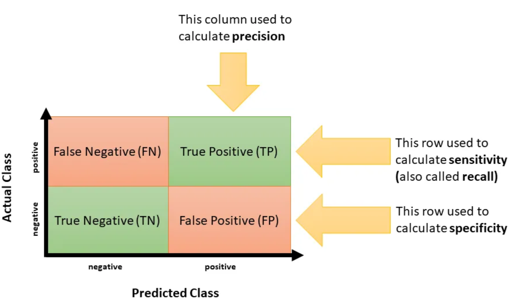
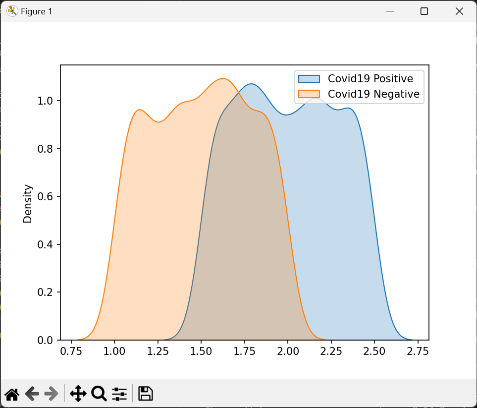
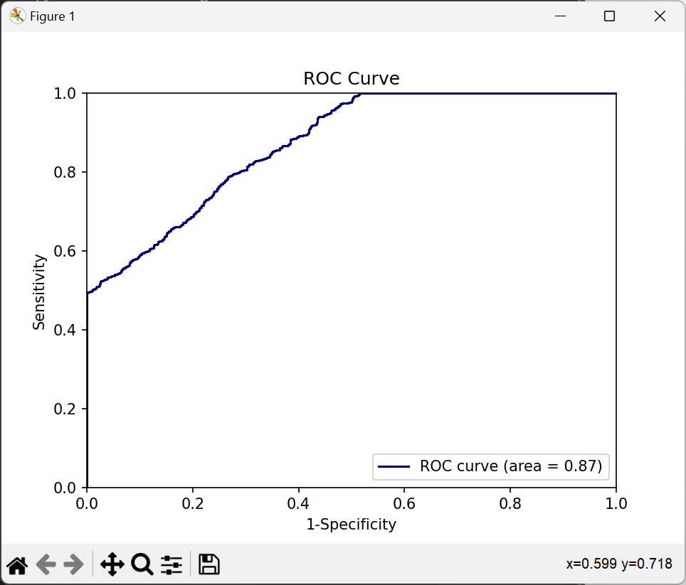

# Receiver Operating Characteristics (ROC)
The Receiver Operating Characteristics, or ROC, is a crucial tool used to evaluate the performance of binary classification models. In simpler terms, it helps us understand how well our model is doing in distinguishing between two classes (like 'sick' vs 'not sick').

## ROC Curve
The ROC curve is a plot of the **true positive rate (TPR)** against the **false positive rate (FPR)** for the different possible cutpoints of a diagnostic test. The area under the ROC curve (AUC) is a measure of how well a parameter can distinguish between two diagnostic groups (diseased/normal). The closer the AUC is to 1, the better the parameter is at distinguishing between the two groups. The closer the AUC is to 0.5, the less accurate the parameter is at distinguishing between the two groups.

    <table>
        <tr>
            <td></td>
            <td></td>
        </tr>
    </table>

    

## Key Metrics

### 1️⃣ Sensitivity (True Positive Rate or Recall)
Sensitivity measures how well the model identifies true positives from the actual positive cases.

$$\text{Sensitivity} = \frac{\text{TP}}{\text{TP+FN}}$$
 
> If the recall is 85%, it means that out of all the actual spam emails in the dataset, the classifier correctly identified 85% of them as spam. Recall helps us understand how well the classifier can find all the positive instances.

### 2️⃣ Specificity (True Negative Rate)
On the flip side, specificity measures how well the model identifies true negatives from the actual negative cases.

$$\text{Specificity} = \frac{\text{TN}}{\text{TN+FP}}$$

> If the specificity is 95%, it means that out of all the actual not spam emails in the dataset, the classifier correctly identified 95% of them as not spam. Specificity tells us how well the classifier can find all the negative instances.

### 3️⃣ Precision (Positive Predictive Value)
Precision provides insight into how many of the cases that the model predicted as positive were actually positive.

$$\text{Precision} = \frac{\text{TP}}{\text{TP+FP}}$$

> If the precision is 80%, it means that when the classifier predicts an email as spam, it is correct 80% of the time. In other words, 80% of the emails classified as spam are genuinely spam.

### 4️⃣ Accuracy
Accuracy gives an overall view of how well the model is performing by considering both true positives and true negatives.

$$\text{Accuracy} = ​\frac{\text{TP+TN}}{\text{TP+TN+FP+FN}}$$

> If our classifier has an accuracy of 90%, it means that out of all the emails it classified, 90% were correctly labeled as spam or not spam. This gives us an overall idea of how often the classifier makes correct predictions.

### 5️⃣ F1 Score
The F1 score is the harmonic mean of precision and recall, providing a balance between the two metrics. It is calculated as:

$$\text{F1} = 2 \times \frac{\text{Precision} \times  \text{Recall}}{\text{Precision + Recall}}$$

F1 Score is a useful metric when there is an imbalance between positive and negative classes.

> The F1 score is a balanced metric that considers both precision and recall. If the F1 score is 82%, it shows a good balance between correctly identifying spam emails and avoiding false positives.

### 6️⃣ False Positive Rate (FPR) or Fall-Out
This metric measures the proportion of negative instances that were incorrectly classified as positive. It is calculated as:

$$\frac{\text{FP}}{\text{FP + TN}}$$

FPR is useful when you want to evaluate the classifier's ability to avoid false alarms in negative instances.

> If the FPR is 5%, it means that 5% of the non-spam emails were incorrectly classified as spam. A lower FPR indicates that the classifier has fewer false alarms for non-spam emails.

### 7️⃣ False Negative Rate (FNR) or Miss Rate
This metric measures the proportion of positive instances that were incorrectly classified as negative. It is calculated as:

$$\frac{\text{FN}}{\text{FN + TP}}$$

FNR is valuable when you want to assess the classifier's ability to avoid missing positive instances.

> If the FNR is 15%, it means that 15% of the spam emails were incorrectly classified as non-spam. A lower FNR indicates that the classifier misses fewer actual spam emails.

### 8️⃣ Matthews Correlation Coefficient (MCC)
MCC is a correlation coefficient between the observed and predicted binary classifications. It is calculated as:

$$\text{MCC} = \frac{(\text{TP} \times \text{TN}) - (\text{FP} \times \text{FN})}{\sqrt{(\text{TP+FP}) (\text{TP+FN}) (\text{TN+FP}) (\text{TN+FN})}}$$

MCC is a balanced metric that is useful even when the classes are of very different sizes.

> MCC ranges from -1 to +1, where +1 represents a perfect classifier, 0 indicates a random classifier, and -1 denotes a classifier that performs exactly opposite to the desired behavior. A higher MCC indicates a better classifier.

### 9️⃣ Informedness (Youden's J Statistic)
Informedness is the difference between the **true positive rate (Recall)** and the **false positive rate (FPR).** It is calculated as Recall + Specificity — 1, ranging from -1 to +1. A higher value indicates a better classifier.

> Informedness ranges from -1 to +1, where a higher value indicates a better classifier. It considers both recall and specificity.

#### 🔍 Note:
- TP: True Positives - Actual positive cases that were correctly identified.
- TN: True Negatives - Actual negative cases that were correctly identified.
- FP: False Positives - Actual negative cases that were wrongly identified as positive.
- FN: False Negatives - Actual positive cases that were wrongly identified as negative.
