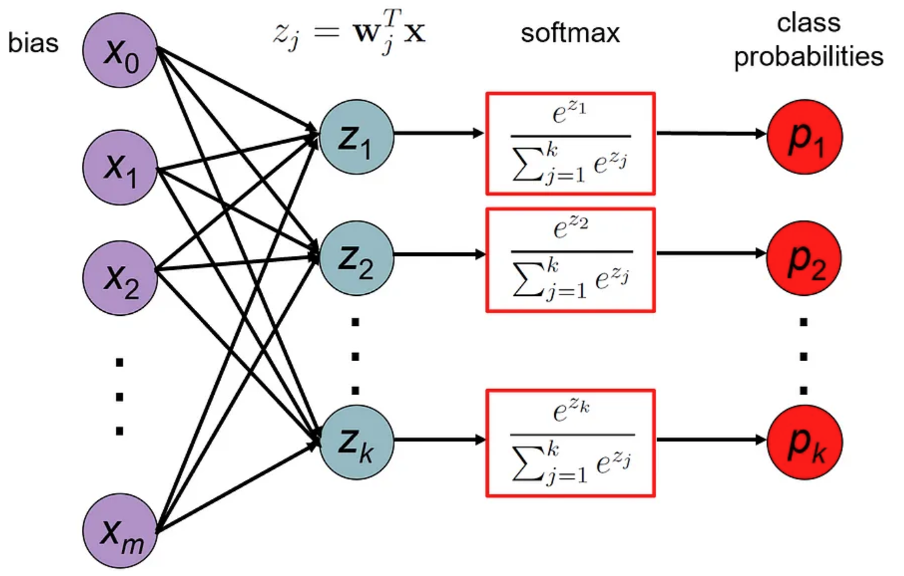

# Softmax Regression
Softmax regression (or multinomial logistic regression) is a generalization of logistic regression to multi-class problems.

It can be used to predict the probabilities of different possible outcomes of some event, such as a patient having a specific disease out of a group of possible diseases based on their characteristics (gender, age, blood pressure, outcomes of various tests, etc.).

As in binary classification problems, we distinguish between two types of classifiers:

1. **Deterministic classifiers** output a hard label for each sample, without providing probability estimates for the classes. Examples for such classifiers include K-nearest neighbors, decision trees, and SVMs.
2. **Probabilistic classifiers** output probability estimates for the $k$ classes, and then assign a label based on these probabilities (typically the label of the class with the highest probability). Examples for such classifiers include softmax regression, Naive Bayes classifiers and neural networks that use softmax in the output layer.

## The Softmax Regression Model
Given a sample $(x, y)$, the softmax regression model outputs a vector of probabilities $p=(p_1, \dots, p_k)^t$, where $p_i$ is the probability that the sample belongs to class $i$.

$$p_i = P(y=i|x)$$

The probabilities must satisfy the following constraints:
$$0 \leq p_i \leq 1$$
$$\sum_{i=1}^k p_i = 1$$

In (binary) logistic regression, our assumption was that the log odds (the logarithm of the ratio between $p$ and $1 − p$) was a linear combination of the input features (the vector $x$).

In softmax regression, we choose one of the probabilities as a reference (let’s say $p_k$), and assume that the log-odds ratio between each probability $p_i$ and $p_k$ is a linear combination of the input features. In other words, we can write the log-odds between $p_i$ and $p_k$ as a dot product of some weight vector $w_i$ and the input vector $x$:

$$\log \frac{p_i}{p_k} = w_i^t x, \quad i=1,\dots,k-1$$

Note that in softmax regression we have a separate vector of parameters $w_i$ for each class $i$. The set of all the parameters of the model is typically stored in a matrix $W$ of size $(m+1) \times k$, obtained by concatenating the vectors $w_1, \dots, w_{k}$ as columns:

$$W = \begin{bmatrix} | & | & \dots & | \\ w_1 & w_2 & \dots & w_{k} \\ | & | & \dots & | \end{bmatrix}$$

By taking the exponent of both sides of the log-odds equation we get:

$$\frac{p_i}{p_k} = \exp(w_i^t x)$$

$$p_i = p_k \exp(w_i^t x)$$

Since all the $k$ probabilities must sum to 1, we can write:

$$p_k = 1 - \sum_{i=1}^{k-1} p_i = 1 - \sum_{i=1}^{k-1} p_k \exp(w_i^t x)$$

$$p_k + p_k \sum_{i=1}^{k-1} \exp(w_i^t x) = 1$$

$$p_k (1 + \sum_{i=1}^{k-1} \exp(w_i^t x)) = 1$$

$$p_k = \frac{1}{1 + \sum_{i=1}^{k-1} \exp(w_i^t x)}$$

We can now use the expression for $p_k$ to write the expression for $p_i$:

$$p_i = \frac{\exp(w_i^t x)}{1 + \sum_{j=1}^{k-1} \exp(w_j^t x)}, \quad i=1,\dots,k-1$$

Since all the $k$ probabilities must sum to 1, the probability $p_k$ is fully determined by the other $k − 1$ probabilities. This means that we can arbitrarily choose $w_k=0$ to make sure that $\exp(w_k^t)=1$. This in turn allows us to write the expression for $p_i$ in a more compact form:

$$p_i = \frac{\exp(w_i^t x)}{\sum_{j=1}^{k} \exp(w_j^t x)}, \quad i=1,\dots,k$$

The function that converts the linear functions $w_i^t x$ into probabilities $p_i$ is called the **softmax function**:

For a multiclass classification, the softmax function $\sigma : \mathbb{R}^K \rightarrow \mathbb{R}^K$ is defined as follows:

$$a_1 = \sigma(z)_1 = \frac{e^{z_1}}{e^{z_1} + e^{z_2} + \ldots + e^{z_K}} = P(y = 1 | x)$$

$$a_2 = \sigma(z)_2 = \frac{e^{z_2}}{e^{z_1} + e^{z_2} + \ldots + e^{z_K}} = P(y = 2 | x)$$

$$\vdots$$

$$a_K = \sigma(z)_K = \frac{e^{z_K}}{e^{z_1} + e^{z_2} + \ldots + e^{z_K}} = P(y = K | x)$$

$$L(a_1, a_2, \ldots, a_K, y) = 
\begin{cases}
-\log(a_1) & \text{if } y = 1 \\
-\log(a_2) & \text{if } y = 2 \\
\vdots \\
-\log(a_K) & \text{if } y = K
\end{cases}$$

Notice that $\text{loss} = -\log(a_i) \text{ if } y = i$. If we plot the graph of $-\log(x)$, we can see that the loss is high when $x$ is close to $0$ and low when $x$ is close to $1$. This is called the **cross-entropy loss**.

The name "softmax" derives from the fact that the function is a smooth approximation of the argmax function. For example, the softmax of the vector (1, 2, 6) is approximately (0.007, 0.018, 0.976), which puts almost all of the unit weight on the maximum element of the vector. The softmax function is an extension of the sigmoid (logistic) function to the multi-class case. In other words, it can be shown that when there are only two classes softmax becomes the sigmoid function. The following diagram summarizes the computational process of the softmax regression model:

    

Mathematically, this process can be written as follows:

$$p = \sigma(W^t x)$$

where $W$ is the matrix of parameters of the model, and $x$ is the input vector.

## Cross-Entropy Loss
Our goal is to find the set of parameters $W$ that will make the model’s predictions $p=\sigma(w_i^t x)$ as close as possible to the true labels $y$. Note that the output of our model is a vector of probabilities, while the true label is a scalar. In order to make them comparable, we encode the labels using **one-hot encoding**, i.e., we convert each label $y$ into a binary vector $y=(y_1, \dots, y_k)^t$, where $y_i=1$ if $y=i$ and $y_i=0$ otherwise. For example, if we have 3 classes, and the true label is 2, then the one-hot encoding of the label is $y=(0, 1, 0)^t$.

A loss function is used to measure how far our model’s prediction is from the true label. The loss function used in softmax regression is called cross-entropy loss, which is an extension of log loss to the multi-class case. It is defined as follows:

$$L_{CE}(W) = - \sum_{i=1}^k y_i \log p_i$$

For example, assume that in a three class problem $(k = 3)$, we are given a sample whose true class is class no. 2 (i.e., $y = (0, 1, 0)^t$), and the prediction of our model for this sample is $p = (0.3, 0.6, 0.1)^t$. Then the cross-entropy loss induced by this sample is:

$$L_{CE}(W) = - \sum_{i=1}^3 y_i \log p_i = - (0 \times \log 0.3 + 1 \times \log 0.6 + 0 \times \log 0.1) = - \log 0.6 = 0.5108$$

## Gradient Descent
As was the case in logistic regression, there is no closed-form solution for the optimal $W$ that minimizes the cross-entropy loss. Therefore, we need to use an iterative optimization method such as gradient descent in order to find the minimum loss.

Fortunately, the cross-entropy loss has a simple gradient (although its derivation is not so simple…). The gradient of the cross-entropy loss with respect to each of the parameter vectors $w_j$ is:

$$\frac{\partial L_{CE}(W)}{\partial w_j} = (p_j - y_j) x, \quad j=1,\dots,k$$