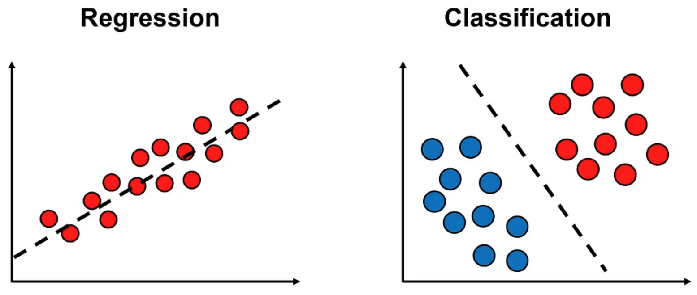

# Supervised Machine Learning
Supervised machine learning is a subfield of machine learning (ML) that deals with building models from labeled data in order to predict the outcomes for unseen data. A labeled data set consists of a set of examples that have been "tagged" or labeled with the correct output.

In supervised machine learning problems, we are given a data set of $n$ labeled samples (also called examples, instances, observations, or data points). Each sample in the data set is a pair consisting of a vector $x$ that contains the features (or attributes) of that sample and its label $y$ (or target output). If we denote by $m$ the number of features in the data set, then $x$ is a m-dimensional vector (we assume that all vectors are column vectors, unless stated otherwise):

$$x = \begin{bmatrix} x_1 & x_2 & \cdots & x_m \end{bmatrix} ^ T$$

## Regression vs. Classification
We distinguish between two types of supervised learning problems:

1. In regression problems, the label $y$ is a continuous value within some range. For example, in a house price prediction task, $y \in (0, \infty)$ is a real positive value that represents the price of the house.
2. In classification problems, the label $y$ is a discrete value from a finite set of possible values. For example, in a spam detection task, $y \in \{0, 1\}$ is a binary value that represents whether the email is spam $(y = 1)$ or not $(y = 0)$. In multi-class classification problems, $y$ can take one of $k$ possible values, where $k$ is the number of classes. For example, in a handwritten digit recognition task, $y \in \{0, 1, \cdots, 9\}$ is a value that represents the digit that was written.

The main difference between regression and classification tasks is that in regression we try to find a function that fits to the data points as closely as possible, while in classification we try to find the boundaries between the classes:

    

## Model Hypothesis
Our goal in supervised learning is to build a model that can predict the labels of new, unseen samples. To that end, we first need to learn the function that maps the feature vectors to labels, $y = f(x)$, based on the given data set.

Since we only have a limited number of samples to learn from, we can only find an approximation to $f(x)$. The learning algorithm analyzes the given data and produces an inferred function $h(x)$ that approximates $f(x)$ as closely as possible.

The function $h$ is an element of some space of possible functions $H$, called the **hypothesis space**. The hypothesis space is the set of all functions that the learning algorithm can possibly select as being the solution. The hypothesis space is determined by the type of the model. For example, in linear regression, $H$ is the set of all linear functions of $x$, while in decision trees, $H$ consists of all the functions that can be represented by a decision tree.

A hypothesis generalizes well from the training data to unseen samples, if its predictions $\hat{y} = h(x)$ for unseen samples are close to the true labels $y$. In this respect, learning can be seen as a search through the hypothesis space $H$ for an hypothesis that can generalize well.

The deviation of the model's predictions from the true labels on unseen data is called the **generalization error** of the model. To estimate the generalization error, we allocate part of the given data set $D$ for testing (usually between 20% to 30% of the data set), and then measure the model's prediction error on the test set.

The test set should be kept apart from the learning process in order not to contaminate the data. **Contamination** occurs when you use information about the test set during the learning process, and can lead to an overly-optimistic estimate of the model's performance.

## Loss Functions and Optimization
An important part of many machine learning models is the choice of a suitable loss function. A loss function $L(y, \hat{y})$ measures the error between the model's predicted label for a given sample $\hat{y}$ and the true label $y$. The loss function is a non-negative value where smaller values are better and perfect predictions incur a loss of 0.

Based on the chosen loss function, we define the cost of the model as its average loss across all the training samples:

$$J(h) = \frac{1}{n} \sum_{i=1}^n L(y_i, h(x_i))$$

<i>Note that a loss function calculates the error per sample, while the cost function calculates the error over the whole data set (although these two terms are sometimes used interchangeably).</i>

Many machine learning models are **parameterized**, i.e., they have a set of learnable parameters (denoted by $w$ or $\theta$) that are tuned during the learning process. For example, in linear regression, the model is parameterized by the weights $w$ and the bias $b$.

In parameterized models, the cost of the model depends on its parameters, therefore we denote its cost function by $J(w)$ or $J(\theta)$. Our goal in this case is to find the set of parameters that minimizes the cost function. This turns the learning problem into an optimization problem, where we search for the optimal parameters that maximize or minimize the cost function.

Some optimization problems have a **closed-form solution**, i.e., we can find directly the set of parameters that minimizes $J(w)$ by solving a system of (typically linear) equations. When there is no closed-form solution, we can use an **iterative optimization method**, which generates a sequence of improving solutions that move toward the optimum. Popular optimization methods in machine learning include `gradient descent` and `Newton's method`.

## Learning Algorithms
The most commonly used supervised learning algorithms are:

* Linear regression
* Logistic regression
* K-nearest neighbors
* Naive Bayes
* Decision trees
* Support vector machines (SVMs)
* Neural networks (Multilayer perceptrons)

Some of these algorithms can handle both regression and classification tasks (such as decision trees and neural networks), while others can handle only one type of problem (e.g., Naive Bayes can handle only classification problems).

Ensemble methods such as `bagging` and `boosting` can combine together multiple algorithms to create more powerful models. Popular ensemble methods include `random forests`, `AdaBoost` and `XGBoost`.

## Generative vs. Discriminative Models
The supervised learning models mentioned above can be grouped under two broad categories: generative models and discriminative models.

**Discriminative models** (such as logistic regression) seek to find a function that discriminates between the different output values, while generative models (such as Naive Bayes) try to learn how the data was generated. **Generative models** can be used not only for prediction, but also for generating new samples.

## Data Sets
There are many data sets that are used in machine learning research and have been cited in peer-reviewed academic journals.

- The [UCI machine learning repository](https://archive.ics.uci.edu/) maintains 622 data sets as a service to the machine learning community.
- [OpenML](https://www.openml.org/) is an open platform for sharing data sets, algorithms, and experiments.
- [Google Dataset Search](https://datasetsearch.research.google.com/) is a search engine for data sets.
- [Kaggle datasets](https://www.kaggle.com/datasets) hosts data sets that have been used in Kaggle competitions.
- [Papers with code](https://paperswithcode.com/) highlights trending machine learning research and the code to implement it.
