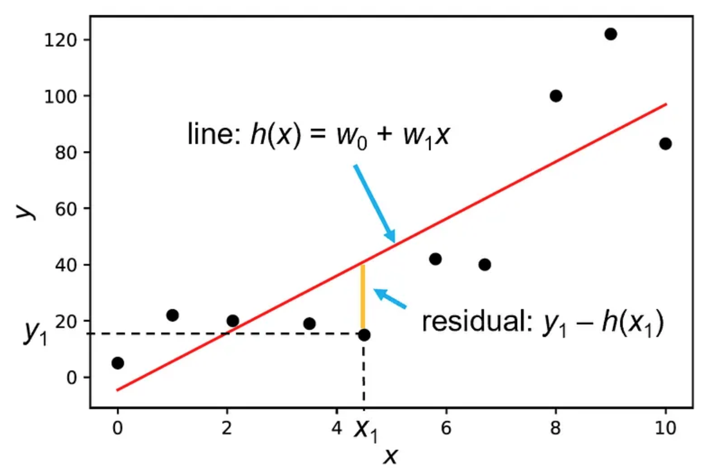

# Regression Problems
In regression problems, we are given a set of $n$ labeled examples: $D={(x_1,y_1),...,(x_n,y_n)}$ where each $x_i$ is a vector that consists of $m$ features: $x_i=(x_{i1},...,x_{im})^t$. The variables $x_{ij}$ are called the independent variables or the explanatory variables. The label $y$ is a continuous-valued variable $(y \in \mathbb{R})$ and is called the dependent variable or the response variable. 

We assume that there is a correlation between the label $y$ and the input vector $x$, which is modeled by some function $f(x)$ and an error variable $\epsilon$:

$$y=f(x)+\epsilon$$

Where $\epsilon$ is the error term that is assumed to have the following properties:
- $\epsilon$ is a random variable that is normally distributed.
- $E(\epsilon)=0$ (the mean of $\epsilon$ is 0).
- $Var(\epsilon)=\sigma^2$ (the variance of $\epsilon$ is $\sigma^2$).
- $\text{Cov}(\epsilon_i,\epsilon_j)=0$ (the covariance between any two error terms is 0).

Our goal is to find the function $f(x)$, since knowing this function will allow us to predict the labels for any new sample. However, since we have a limited number of training samples from which to learn the function $f(x)$, we can only approximate it. The function that our model estimates from the given data is called the model's hypothesis and is typically denoted by $h(x)$.

## Linear Regression
In linear regression, we assume that there is a linear relationship between the features and the target label. Therefore, the model's hypothesis takes the following form:

$$h(x)=w_0+w_1x_1+...+w_mx_m$$

Where $w_0, w_1,...,w_m$ are the parameters of the model. The parameter $w_0$ is often called the intercept (or bias), since it represents the intersection point of the graph of $h(x)$ with the y-axis (in two dimensions). 

To simplify $h(x)$, we add a constant feature $x_0$ that is always equal to 1. This allows us to write $h(x)$ as the dot product between the feature vector $x=(x_0,x_1,...,x_m)^t$ and the parameter vector $w=(w_0,w_1,...,w_m)^t$:

$$h(x)= W^tX = \sum_{j=0}^{m}w_jx_j$$

## Ordinary Least Squares (OLS)
Our goal in linear regression is to find the parameters $w$ that will make our model's predictions $h(x)$ be as close as possible to the true labels $y$. In other words, we would like to find the model's parameters that best fit the data set. To that end, we define a **cost function** (sometimes also called an error function) that measures how far our model's predictions are from the true labels.

We start by defining the residual as the difference between the label of a given data point and the value predicted by the model:

$$r_i=y_i-h(x_i)$$

**Ordinary least squares (OLS)** regression finds the optimal parameter values that minimize the sum of squared residuals:

$$J(w)=\sum_{i=1}^{n}r_i^2=\sum_{i=1}^{n}(y_i-h(x_i))^2=\sum_{i=1}^{n}(y_i-W^tX_i)^2$$

Note that a loss function calculates the error per observation and in OLS it is called the squared loss, while a cost function (typically denoted by $J$) calculates the error over the whole data set, and in OLS it is called the sum of squared residuals (SSR) or sum of squared errors (SSE).

## Simple Linear Regression
When the data set has only one feature i.e., when it consists of two-dimensional points $(x_i,y_i)$, the regression problem is called simple linear regression. Geometrically, in simple linear regression, we are trying to find a straight line that goes as close as possible through all the data points:

    

In this case, the model’s hypothesis is simply the equation of the line:

$$h(x)=w_0+w_1x$$

Where $w_1$ is the slope of the line and $w_0$ is the intercept. The residuals in this case are the vertical distances between the data points and the line. The least squares cost function is the sum of the squared residuals:

$$J(w_0, w_1)=\sum_{i=1}^{n}(y_i-h(x_i))^2=\sum_{i=1}^{n}(y_i-(w_0+w_1x_i))^2$$

## The Normal Equations
Our objective is to find the parameters $w_0$ and $w_1$ of the line that best fits the points, i.e., the line that leads to the minimum cost. To that end, we can take the partial derivatives of $J(w_0, w_1)$ with respect to $w_0$ and $w_1$, set them to zero, and then solve the resulting system of equations (which are called the normal equations).

$$
\begin{align*}
\frac{\partial J(w_0, w_1)}{\partial w_0} &= \frac{\partial}{\partial w_0} \sum_{i=1}^{n} (y_i - (w_0 + w_1x_i))^2 & \text{(definition of $J$)} \\
&= \sum_{i=1}^{n} \frac{\partial}{\partial w_0}(y_i - (w_0 + w_1x_i))^2 & \text{(sum of derivatives)} \\
&= \sum_{i=1}^{n} 2(y_i - (w_0 + w_1x_i))\frac{\partial}{\partial w_0}(y_i - (w_0 + w_1x_i)) & \text{(chain rule of derivatives)} \\
&= \sum_{i=1}^{n} 2(y_i - (w_0 + w_1x_i)) \cdot (-1) & \text{(partial derivative)} \\
&= \sum_{i=1}^{n} 2(w_0 + w_1x_i - y_i)
\end{align*}
$$

Setting this derivative to 0 yields the following:

$$
\begin{align*}
\sum_{i=1}^{n} 2(w_0 + w_1x_i - y_i) &= 0 \\
n\cdot w_0 + w_1\sum_{i=1}^{n} x_i - \sum_{i=1}^{n} y_i &= 0 \\
w_0 = \frac{\sum_{i=1}^{n} y_i - w_1\sum_{i=1}^{n} x_i}{n}
\end{align*}
$$

Similarly, we can take the partial derivative of $J(w_0, w_1)$ with respect to $w_1$:

$$
\begin{align*}
\frac{\partial J(w_0, w_1)}{\partial w_1} &= \frac{\partial}{\partial w_1} \sum_{i=1}^{n} (y_i - (w_0 + w_1x_i))^2 & \text{(definition of $J$)} \\
&= \sum_{i=1}^{n} \frac{\partial}{\partial w_1}(y_i - (w_0 + w_1x_i))^2 & \text{(sum of derivatives)} \\
&= \sum_{i=1}^{n} 2(y_i - (w_0 + w_1x_i))\frac{\partial}{\partial w_1}(y_i - (w_0 + w_1x_i)) & \text{(chain rule of derivatives)} \\
&= \sum_{i=1}^{n} 2(y_i - (w_0 + w_1x_i)) \cdot (x_i) & \text{(partial derivative)} \\
\end{align*}
$$

Setting this derivative to 0 yields the following:

$$
\begin{align*}
\sum_{i=1}^{n} 2(y_i - (w_0 + w_1x_i)) \cdot (x_i) &= 0 \\
\sum_{i=1}^{n} x_iy_i - w_0\sum_{i=1}^{n} x_i - w_1\sum_{i=1}^{n} x_i^2 &= 0 \\
\end{align*}
$$

Let's substitute $w_0$ in the second equation with the value we found for it in the first equation:

$$
\begin{align*}
\sum_{i=1}^{n} x_iy_i - \left(\frac{\sum_{i=1}^{n} y_i - w_1\sum_{i=1}^{n} x_i}{n}\right)\sum_{i=1}^{n} x_i - w_1\sum_{i=1}^{n} x_i^2 &= 0 \\
\sum_{i=1}^{n} x_iy_i - \left(\frac{\sum_{i=1}^{n} x_i \sum_{i=1}^{n} y_i}{n}\right) + w_1 \left(\frac{(\sum_{i=1}^{n} x_i)^2}{n}\right) - w_1\sum_{i=1}^{n} x_i^2 &= 0 \\
w_1 \left[\left(\sum_{i=1}^{n} x_i\right)^2 - n\sum_{i=1}^{n} x_i^2\right] &= n\sum_{i=1}^{n} x_iy_i - \sum_{i=1}^{n} x_i \sum_{i=1}^{n} y_i \\
w_1 &= \frac{n\sum_{i=1}^{n} x_iy_i - \sum_{i=1}^{n} x_i \sum_{i=1}^{n} y_i}{n\sum_{i=1}^{n} x_i^2 - (\sum_{i=1}^{n} x_i)^2}
\end{align*}
$$

Therefore, the optimal values for $w_0$ and $w_1$ are:

$$
w_1 = \frac{n\sum_{i=1}^{n} x_iy_i - \sum_{i=1}^{n} x_i \sum_{i=1}^{n} y_i}{n\sum_{i=1}^{n} x_i^2 - (\sum_{i=1}^{n} x_i)^2} = r_{xy}\frac{s_y}{s_x}
$$

$$
w_0 = \frac{\sum_{i=1}^{n} y_i - w_1\sum_{i=1}^{n} x_i}{n} = \bar{y} - w_1\bar{x}
$$

Where $r_{xy}$ is the Pearson correlation coefficient between $x$ and $y$, $s_x$ is the standard deviation of $x$, and $s_y$ is the standard deviation of $y$. Note that $r_{xy}$ is a measure of the strength of the linear relationship between $x$ and $y$, and it is always between -1 and 1. If $r_{xy}$ is close to 1, then $x$ and $y$ have a strong positive linear relationship. If $r_{xy}$ is close to -1, then $x$ and $y$ have a strong negative linear relationship. If $r_{xy}$ is close to 0, then $x$ and $y$ have a weak linear relationship.

## Evaluation Metrics
There are several evaluation metrics that are used to evaluate the performance of regression models. The two most common ones are RMSE (Root Mean Squared Error) and $R^2$ (R-squared) score.

Note the difference between an evaluation metric and a cost function. A cost function is used to define the objective of the model’s learning process and is computed on the training set. Conversely, an evaluation metric is used after the training process to evaluate the model on a holdout data set (a validation or a test set).

## Root Mean Squared Error (RMSE)
RMSE is defined as the square root of the mean of the squared errors (the differences between the model’s predictions and the true labels):

$$RMSE=\sqrt{\frac{1}{n}\sum_{i=1}^{n}(y_i-h(x_i))^2}$$

Note that what we called residuals during the model’s training are typically called errors (or prediction errors) when they are computed over the holdout set.

RMSE is always non-negative, and a lower RMSE means the model has a better fit to the data (a perfect model has an RMSE of 0).

### Advantages of RMSE
- Provides a measure for the average magnitude of the model’s errors.
- Since the errors are squared before they are averaged, RMSE gives a relatively higher weight to large errors.
- Can be used to compare the performance of different models on the same data set.

### Disadvantages of RMSE
- Cannot be used to compare the model’s performance across different data sets, because it depends on the scale of the input features.
- Sensitive to outliers, since the effect of each error on the RMSE is proportional to the size of the squared error.

## R-squared ($R^2$) Score
The $R^2$ score (also called the coefficient of determination) is a measure of the goodness of fit of a model. It computes the ratio between the sum of squared errors of the regression model and the sum of squared errors of a baseline model that always predicts the mean value of $y$, and subtracts the result from 1:

$$R^2=1-\frac{\sum_{i=1}^{n}(y_i-h(x_i))^2}{\sum_{i=1}^{n}(y_i-\bar{y})^2}$$

Where $\bar{y}$ is the mean value of $y$:

$$\bar{y}=\frac{1}{n}\sum_{i=1}^{n}y_i$$

The $R^2$ score is always between 0 and 1, and a higher $R^2$ score means the model has a better fit to the data (a perfect model has an $R^2$ score of 1).

### Advantages of $R^2$ Score
- Does not depend on the scale of the features.
- Can be used to compare the performance of different models across different data sets.

### Disadvantages of $R^2$ Score
- Does not provide information on the magnitude of the model’s errors.
- $R^2$ score is monotonically increasing with the number of features the model has, thus it cannot be used to compare models with very different numbers of features.

## Partitioning the Variance
The total sum of squares (SST) is divided into two parts: the regression sum of squares (SSR) and the residual sum of squares (SSE). The regression sum of squares measures the amount of variation in the response that is explained by the regression model. The residual sum of squares measures the amount of variation in the response that is not explained by the regression model.

| Sum of Squares | Formula | Degrees of Freedom |
| --- | --- | --- |
| Total sum of squares (SST) | $\sum_{i=1}^{n}(y_i-\bar{y})^2$ | $n-1$ |
| Regression sum of squares (SSR) | $\sum_{i=1}^{n}(h(x_i)-\bar{y})^2$ | $1$ |
| Residual sum of squares (SSE) | $\sum_{i=1}^{n}(y_i-h(x_i))^2$ | $n-2$ |

The $R^2$ score can be computed as the ratio between the regression sum of squares and the total sum of squares:

$$R^2=\frac{SSR}{SST}$$

$$R^2=1-\frac{SSE}{SST}$$

**Question:** How important is $x$ in predicting $y$?

**Answer:** We can use a $t$-test to determine whether the slope of the regression line is significantly different from 0.

$$H_0: \beta_1 = 0 \text{ (the slope of the regression line is 0)}$$

$$H_1: \beta_1 \neq 0 \text{ (the slope of the regression line is not 0)}$$

The test statistic is:

$$t = \frac{\hat{\beta}_1}{\text{SE}(\hat{\beta}_1)}$$

Where $\hat{\beta}_1$ is the estimated value of the slope and $\text{SE}(\hat{\beta}_1)$ is the standard error of the slope. The $t$-statistic is a measure of how many standard deviations $\hat{\beta}_1$ is away from 0. If the $t$-statistic is large, then the slope is significantly different from 0.

The $p$-value is the probability of observing a $t$-statistic as extreme as the one observed, assuming the null hypothesis is true. If the $p$-value is small, then the slope is significantly different from 0.

$$p = P(|T| > |t|)$$

Where $T$ is a $t$-distribution with $n-2$ degrees of freedom.