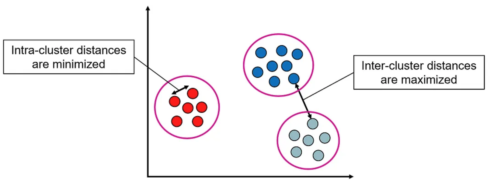
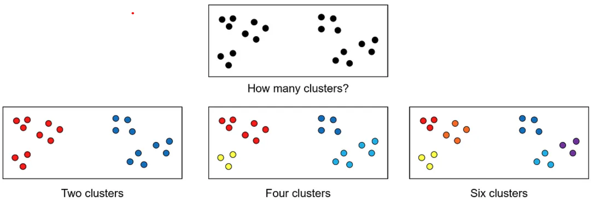

# Clustering
Clustering is an unsupervised learning technique that groups a set of objects such that objects in the same group (cluster) are more similar to each other than to those in other groups.

Formally, we are given a set of $n$ data points: ${x_1, \cdots, x_n}$, where each $x_i$ is a $m$-dimensional vector, and we would like to partition the points into $k$ sets (clusters) ${C_1, \cdots, C_k}$ such that:

1. **Intra-cluster distances** are minimized: data points within the same cluster are as close as possible to one another.
2. **Inter-cluster distances** are maximized: data points from different clusters are as far as possible from one another.

The entire set of clusters $C_1, \cdots, C_k$ forms a **clustering** of the data.

    

Determining the ideal number of clusters or the optimal clustering is often subjective, or as the saying goes “clustering is in the eye of the beholder”. For example, one can argue that the following dataset consists of two, four, or even six clusters:

    

The lack of a precise definition of clusters as well as the computational difficulties in finding an optimal grouping give rise to many different approaches to cluster analysis, which are discussed in the next section.

## Types of Clustering
Clustering methods can be categorized into various types based on their approach for identifying clusters and their underlying clustering model. Each type is suitable for different kinds of datasets and applications. The main types of clustering include:

1. **Partitioning clustering:** Divides the dataset into a set of non-overlapping clusters in a way that optimizes a certain criterion, such as minimizing the distances between points within clusters. Examples for partitioning clustering techniques include k-means and k-medoids (PAM).

2. **Hierarchical clustering:** Constructs a hierarchy of clusters, represented as a tree-like structure called dendrogram. Hierarchical clustering can be implemented as agglomerative (bottom-up) or divisive (top-down).

3. **Density-based clustering:** Defines clusters as dense regions of points separated by regions of lower density. DBSCAN is a prime example for a density-based clustering.

4. **Model-based clustering:** Assumes that the data points in each cluster are generated by a statistical model, and fits the data to these models. A prominent example of model-based clustering is Gaussian Mixture Models (GMM), where each cluster is modeled as a Gaussian distribution, and the entire dataset is considered as a mixture of these distributions.

5. **Graph-based clustering:** Treats the data as a graph, where data points are nodes, and edges represent similarities between these points. Spectral clustering is an example for a graph-based clustering method.

6. **Grid-based clustering:** Divides the data space into a finite number of cells that form a grid structure, and clustering is performed on this grid instead of the data points themselves. Examples for grid-based algorithms include CLIQUE and STING.

## Challenges in Clustering
Clustering algorithms face several challenges that can affect the quality and effectiveness of the clustering results:

1. **Determining the number of clusters:** Many clustering algorithms, such as k-means, require specifying the number of clusters in advance, which is not always apparent and may require iterative experimentation.

2. **Varying cluster shapes and sizes:** Clusters can vary greatly in their shape, density or size, and not all algorithms handle these variations well.

3. **Scalability:** Handling large datasets efficiently is a challenge for many clustering algorithms, whose runtime and memory requirements may not scale well with the increase in dataset size.

4. **Handling high-dimensional data:** Clustering algorithms typically rely on measuring distances between points to form clusters. In high-dimensional datasets, the data becomes sparse and distances between points become increasingly uniform and less informative (a phenomenon known as the curse of dimensionality).

5. **Sensitivity to noise and outliers:** The presence of noise and outliers can significantly affect the clustering results, leading to incorrect clusters or misclassified data points.

6. **Hyperparameter tuning:** Many clustering algorithms have parameters that need to be fine-tuned for optimal performance.

7. **Interpretation and validation:** The interpretation of clusters can be subjective and may vary depending on the perspective of the domain expert. Clustering evaluation involves various methods and metrics that measure how well the data points have been grouped into clusters. Evaluation of the clustering results can be as hard as the clustering itself.

8. **Ethical and privacy concerns:** Clustering algorithms may unintentionally reflect biases in the input data. In addition, they may raise privacy concerns, especially in applications involving sensitive personal data, such as customer segmentation and medical data analysis.