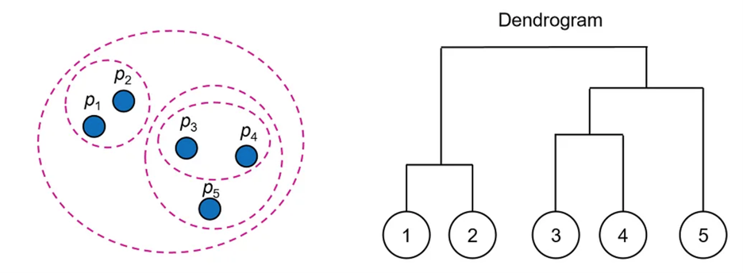
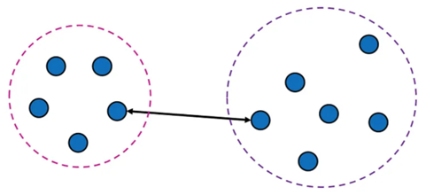
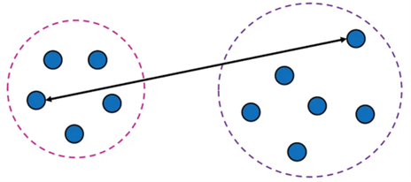
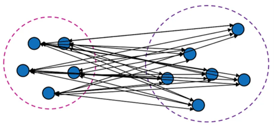
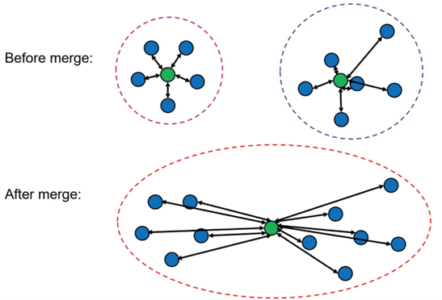
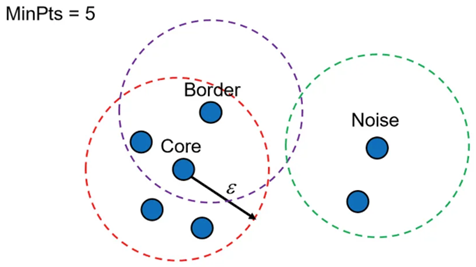

# K-Means Clustering
K-means is a centroid based clustering technique that partitions a dataset into k distinct clusters, where each data point belongs to the cluster with the nearest center.

## Centroid-Based Clustering
Each cluster is represented by a central vector, called the cluster center or centroid, which is not necessarily the member of the dataset. The cluster centroid is typically formed as the mean of the points that belong to that cluster.

Formally, given $n$ data points: ${x_1, x_2, ..., x_n}$, where each data point is a $m$-dimensional real vector, $x_i \in \mathbb{R}^m$, and an integer $k$, where $k < n$, the goal is to find a set of $k$ points, $C = {c_1, c_2, ..., c_k}$, in $\mathbb{R}^m$ to minimize the objective function:

$$\sum_{i=1}^{k} \sum_{x \in C_i} \left\| x - c_i \right\|^2$$

where $C_i$ is the $i$-th cluster in $C$. The objective function is also called the **distortion** of the clustering or the **inertia** of the cluster set or the **within-cluster sum-of-squares** (WCSS).

## K-Means Algorithm
1. Randomly select $k$ points as the initial centroids.
2. Assignmnet step: assign each data point to the cluster with the nearest centroid.

$$C_i = \{x \in X: \left\| x - c_i \right\|^2 \leq \left\| x - c_j \right\|^2 \forall j, 1 \leq j \leq k\}$$

3. Update step: calculate the new centroids of each cluster.

$$c_i = \frac{1}{|C_i|} \sum_{x \in C_i} x$$

4. Repeat steps 2 and 3 until the centroids do not change.

The K-Means algorithm is guaranteed to converge to solution; however, it might be a local minimum. Due to the sensitivity of the algorithm to the initial choice of centroids, it is common to run it multiple times with different initializations. The time complexity of the algorithm is $O(knmt)$, where $k$ is the number of clusters, $n$ is the number of data points, $m$ is the number of dimensions, and $t$ is the number of iterations.

## Initialization Methods
- **Forgy**: Randomly choose $k$ data points as the initial centroids.
- **Random Partition**: Randomly assign each data point to a cluster and calculate the initial centroids as the mean of the data points in each cluster.

Both methods are sensitive to outliers. A better initialization method is **K-Means++**.

## K-Means++
1. Randomly choose the first centroid from the data points.
2. For each data point, calculate the distance $D(x)$ between the point and the nearest centroid that has already been chosen.
3. Randomly choose the next centroid from the data points such that the probability of choosing a point $x$ is proportional to $D(x)^2$.
4. Repeat steps 2 and 3 until $k$ centroids have been chosen.
5. Proceed with the standard K-Means algorithm.

## Choosing the Number of Clusters
The number of clusters $k$ is a hyperparameter of the algorithm. There is no easy way to choose the best $k$; however, there are some methods that can help.

### Elbow Method
The elbow method is a heuristic method that plots the distortion for different values of $k$ and chooses the value of $k$ at the "elbow" of the plot.

### Silhouette Score
The silhouette score is a metric that measures how similar a data point is to its own cluster compared to other clusters. The silhouette score ranges from -1 to 1, where a high value indicates that the data point is well matched to its own cluster and poorly matched to neighboring clusters. If most data points have a high silhouette score, then the clustering configuration is appropriate. If many data points have a low or negative silhouette score, then the clustering configuration may have too many or too few clusters.

### Limitations of K-Means
- The algorithm is sensitive to outliers.
- The algorithm is sensitive to the initial choice of centroids.
- The algorithm is not suitable for clusters with non-convex shapes.
- The algorithm is not suitable when the clusters have different sizes and densities.

# Hierarchical Clustering
Hierarchical clustering is a clustering technique that builds a hierarchy of clusters. It is also known as hierarchical cluster analysis or HCA. Hierarchical clustering algorithms can be classified into two types: **agglomerative** and **divisive**.

1. **Agglomerative (bottom-up)**: Each data point starts in its own cluster, and pairs of clusters are merged together until all clusters have been merged into one big cluster.
2. **Divisive (top-down)**: All data points start in one cluster, and splits are performed recursively until each data point is in its own cluster.

The results of hierarchical clustering are usually presented in a dendrogram. A dendrogram is a tree-like structure that shows the sequence in which clusters were merged (or split) and the distance at which each merge (or split) took place.

## Distance Matrix
The main data structure used by hierarchical clustering algorithms, which allows them to keep track of distances between clusters, is the distance matrix.

If the dataset has n data points $x_1, x_2, ..., x_n$, then the distance matrix is an $n \times n$ matrix $D$ such that $D_{ij}$ is the distance between data points $x_i$ and $x_j$. The distance matrix is symmetric, i.e. $D_{ij} = D_{ji}$ and its diagonal entries are zero, i.e. $D_{ii} = 0$.

## Linkage Methods
In order to decide which clusters to combine (or split), we need a measure of distance between two sets of points (clusters). A linkage method (or criterion) specifies how distances between clusters are calculated.

### Single Linkage ($\min$)
The distance between two clusters is the minimum distance between any two points in the clusters.

$$d(C_i, C_j) = \min_{x \in C_i, y \in C_j} \left\| x - y \right\|$$

- Single linkage is sensitive to noise and outliers.
- Single linkage tends to produce long, "loose" clusters.
- It can capture non-convex clusters.
- It is prone to "chaining" effect where clusters are connected by a thin line of points.

### Complete Linkage ($\max$)
The distance between two clusters is the maximum distance between any two points in the clusters.

$$d(C_i, C_j) = \max_{x \in C_i, y \in C_j} \left\| x - y \right\|$$

- Complete linkage is less sensitive to noise and outliers than single linkage.
- It tends to produce compact clusters.
- Struggles to capture non-convex clusters.

### Average Linkage ($\text{avg}$)
The distance between two clusters is the average distance between any two points in the clusters.

$$d(C_i, C_j) = \frac{1}{|C_i| |C_j|} \sum_{x \in C_i} \sum_{y \in C_j} \left\| x - y \right\|$$

- Centroid linkage is less sensitive to noise and outliers than single linkage.
- Less suitable for non-globular clusters.
- Can suffer from "inversion phenomenon" where merging two clusters increases the overall distortion.
- Supports only Euclidean distance.

### Ward's Method
Ward's method is a hierarchical clustering algorithm that minimizes the total within-cluster variance. The within-cluster variance is defined as the sum of the squared distances between each point and the cluster centroid.

$$d(C_i, C_j) = \frac{|C_i| |C_j|}{|C_i| + |C_j|} \left\| c_i - c_j \right\|^2$$

where $c_i$ and $c_j$ are the centroids of clusters $C_i$ and $C_j$ respectively.

- Ward's method is less sensitive to noise and outliers than single linkage.
- Assumes that the clusters have approximately the same size.
- Less suitable for non-globular clusters.
- Supports only Euclidean distance.

# Agglomerative Clustering Algorithm
The algorithm gets a distance matrix D and a linkage criterion, and performs the following steps:

1. Initialize each data point as a cluster.
2. Repeat until there is only one cluster:
    1. Find the closest pair of clusters according to the linkage criterion.
    2. Merge the two clusters into a single cluster.
    3. Update the distance matrix.

The time complexity of the algorithm is $O(n^3)$, where $n$ is the number of data points. However, the time complexity can be reduced to $O(n^2 \log n)$ by using a priority queue to store the distances between clusters.

# DBSCAN: Density-Based Spatial Clustering of Applications with Noise
DBSCAN is a density-based clustering algorithm that groups together points that are closely packed together while filtering out noise points that lie in low-density regions.

> Unlike k-means, DBSCAN can identify clusters of various shapes and sizes, and it does not require the number of clusters to be specified in advance.

DBSCAN determines the density of an area based on two parameters:
- **Epsilon ($\epsilon$)**: The radius of the neighborhood around a data point.
- **Minimum Points ($\text{minPts}$)**: The minimum number of data points required to form a dense region.

Based on these two parameters, the algorithm differentiates between three types of data points:

1. **Core Points**: A data point is a core point if at least $\text{minPts}$ points are within a distance of $\epsilon$ from it.
2. **Border Points**: A data point is a border point if it is within a distance of $\epsilon$ from a core point, but it is not a core point itself.
3. **Noise Points**: A data point is a noise point if it is neither a core point nor a border point.

In addition, we define reachability relations between points:
- A point $p$ is **directly reachable** from a point $q$ if $p$ is within a distance of $\epsilon$ from $q$ and $q$ is a core point.
- A point $p$ is **reachable** from a point $q$ if there is a path $p_1, ..., p_n$ such that $p_1 = q$ and $p_n = p$ and $p_{i+1}$ is directly reachable from $p_i$.

The DBSCAN algorithm works as follows:
1. Randomly choose a data point $p$.
2. Retrieve all points directly reachable from $p$.
3. If $p$ is a core point, a cluster is formed.
4. If $p$ is a border point, no points are reachable from $p$, and DBSCAN visits the next point of the database.
5. Repeat steps 1-4 until all points have been processed.

DBSCAN algorithm is deterministic – always generating the same clusters – when presented with the same data points in the same order. However, the results may vary when the data points are presented in a different order.