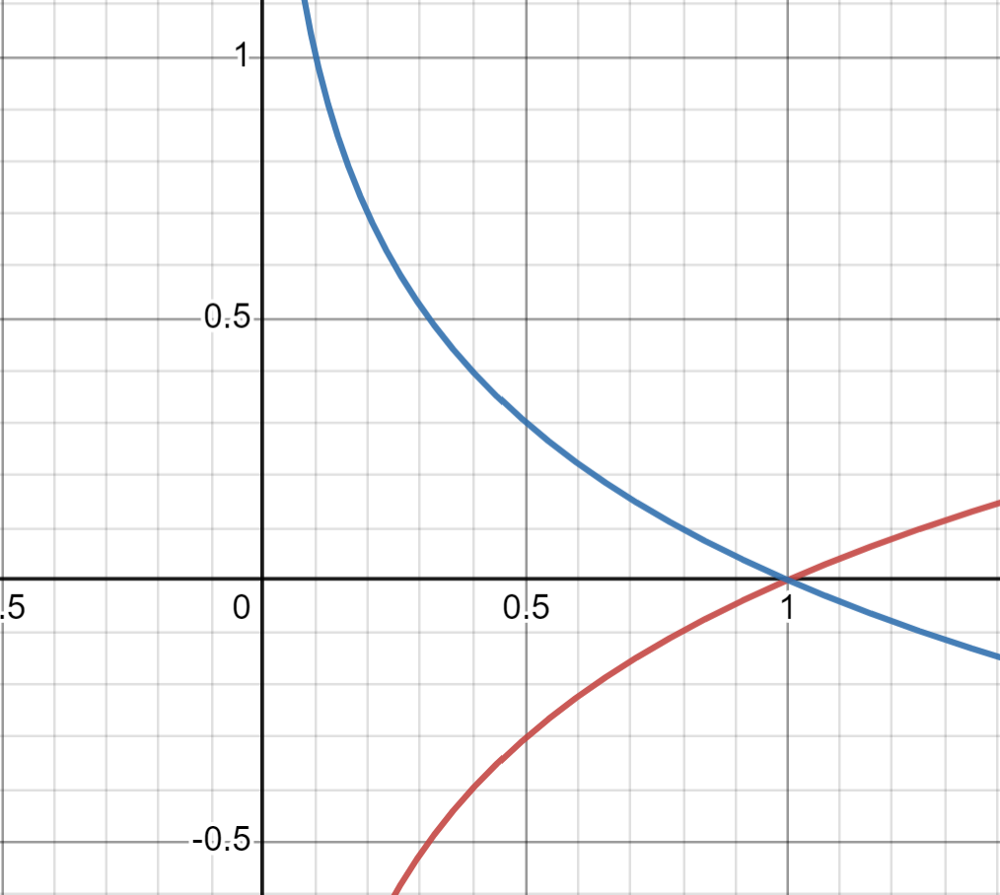

# Classification
Classification is a supervised learning approach in which the computer program learns from the data input given to it and then uses this learning to classify new observation.

## Types of Classification
- Linear Models
- Support Vector Machines
- Decision Trees
- Random Forest
- Naive Bayes
- K-Nearest Neighbors
- Neural Networks

## Linear Models
Linear models are the simplest classification models. They are called linear because a linear function (a line in 2D, a plane in 3D) is used to discriminate between the two classes. The most common linear classification algorithm is the logistic regression.

## Sigmoind Function (Logistic Function)
The sigmoid function is a mathematical function used to map the predicted values to probabilities. It maps any real value into another value between 0 and 1. In machine learning, we use sigmoid to map predictions to probabilities.

$$\sigma(z) = \frac{1}{1+e^{-z}}$$

## Logistic Regression
Logistic regression is a statistical model that in its basic form uses a logistic function to model a binary dependent variable, although many more complex extensions exist. In regression analysis, logistic regression (or logit regression) is estimating the parameters of a logistic model (a form of binary regression).

For logistic regression, the hypothesis is defined as:

$$f_{w,b}(x) = \sigma(w^Tx + b)$$

where $w$ is the weight vector, $b$ is the bias, and $\sigma$ is the sigmoid function.

$$\sigma(w^Tx + b) = \frac{1}{1+e^{-(w^Tx + b)}}$$

We interpret the output of the hypothesis $f_{w,b}(x)$ as the probability that $y=1$ on input $x$ parameterized by $w$ and $b$. Therefore, to get a final prediction $y=0 \text{ or } y=1$, we can set a threshold at 0.5. If the output of the hypothesis is greater than 0.5, we predict $y=1$, otherwise we predict $y=0$.

## Cost Function
For linear regression, we use the mean squared error (MSE) as the cost function. However, for logistic regression, the MSE cost function is non-convex, which means that it has many local minimums and gradient descent may not find the global minimum. Therefore, we use the cross-entropy loss function as the cost function for logistic regression.

Let's consider the loss function for a single training example as:

$$L(f_{w,b}(x^{(i)}), y^{(i)}) = \begin{cases} 
-log(f_{w,b}(x^{(i)})) & \text{if } y^{(i)} = 1 \\ 
-log(1-f_{w,b}(x^{(i)})) & \text{if } y^{(i)} = 0 
\end{cases}$$

The loss function for the entire training set is the average of the loss function for each training example:

$$J(w,b) = \frac{1}{m}\sum_{i=1}^{m}L(f_{w,b}(x^{(i)}), y^{(i)})$$

## Cost Function Intuition
The negative log function is a convex function shown below. This means that gradient descent will always converge to the global minimum.

### Cost Function Intuition
The negative log function is a convex function shown below. This means that gradient descent will always converge to the global minimum.

| $y=1$ | $y=0$ |
| --- | --- |
| The graph of $-log(f_{w,b}(x^{(i)}))$ is shown below: | The graph of $-log(1-f_{w,b}(x^{(i)}))$ is shown below: |
|  |  |
| In this case, if $f_{w,b}(x) = 1$, the loss is 0. If $f_{w,b}(x) \rightarrow 0$, the loss goes to infinity. Therefore, the model will try to predict a probability close to 1 for $y=1$ and penalize the model heavily if it predicts a probability close to 0. | In this case, if $f_{w,b}(x) = 0$, the loss is 0. If $f_{w,b}(x) \rightarrow 1$, the loss goes to infinity. Therefore, the model will try to predict a probability close to 0 for $y=0$ and penalize the model heavily if it predicts a probability close to 1. |
